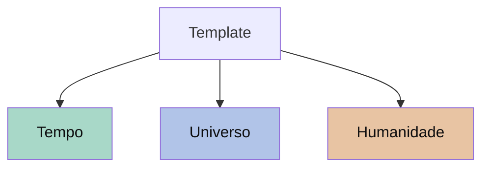

# Bem-vindo ao Co

Co é uma plataforma para organizar ideias, projetos e pessoas em **universos**: espaços de conteúdo conectados, com várias visões do mesmo material.

## Universos curados

Três universos do **template** demonstram a linha do tempo do Co — do **Big Bang** ao **agora**. Cada um é independente; juntos formam uma narrativa em escala log.

## Como começar

- **Quadro** — arraste e organize tarefas como em um kanban.
- **Tabela** — visão linear, ideal para revisar e filtrar.
- **Conteúdo** — leitura corrida do que foi escrito.
- **Linha do tempo** — eventos numa escala log, do passado profundo ao agora.

Quando quiser organizar suas próprias coisas, faça login e clique em **+ Novo universo** na barra lateral.
