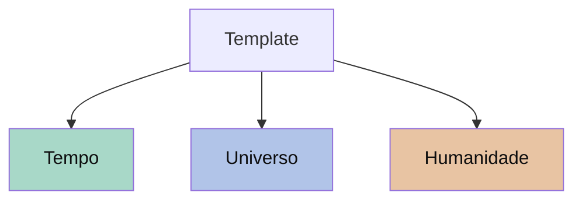

# **Co**nsciência **Co**letiva

Co é uma plataforma para **conectar pessoas** — ideias, projetos e presenças online se entrelaçando em universos compartilhados.

Três verbos definem o que fazemos:

- **Co**criar — cada cartão é uma ideia. Escreva, arraste, conecte.
- **Co**laborar — convide pessoas para seu universo. Editem juntos, em tempo real.
- **Co**nectar os pontos — seus universos formam uma rede. Cada perfil é uma presença online; cada conexão, um nó na consciência coletiva.

## O que é um universo?

Um universo é seu espaço — um projeto pessoal, um portfólio, um blog, o painel de uma equipe. Você decide o que entra e como aparece.

Universos **privados** são como perfis — sua identidade digital. Universos **públicos** são vitrines para o mundo, conectadas pela rede.

## Universos curados

Três universos do **template** desenham a linha do tempo do Co — do **Big Bang** ao **agora**. Cada um é independente; juntos formam uma narrativa em escala log.

## Como navegar

- **Quadro** — arraste e organize ideias como num kanban.
- **Tabela** — visão linear, ideal para revisar e filtrar.
- **Conteúdo** — leitura corrida do que foi escrito.
- **Linha do tempo** — eventos em escala log, do passado profundo ao presente.

## Tudo é seu

Cada cartão, cada página, cada nota é um arquivo `.md` com metadados YAML. Sincronize com o Obsidian, edite no VS Code, versione no Git. Você nunca fica preso — o conteúdo é seu, em formato aberto.

Co é software livre, licenciado sob MIT. Código em [github.com/artelonga/co](https://github.com/artelonga/co).

Quando quiser começar o seu universo, faça login e clique em **+ Novo universo** na barra lateral.

---

*Co — conectando pessoas, conectando os pontos.*
