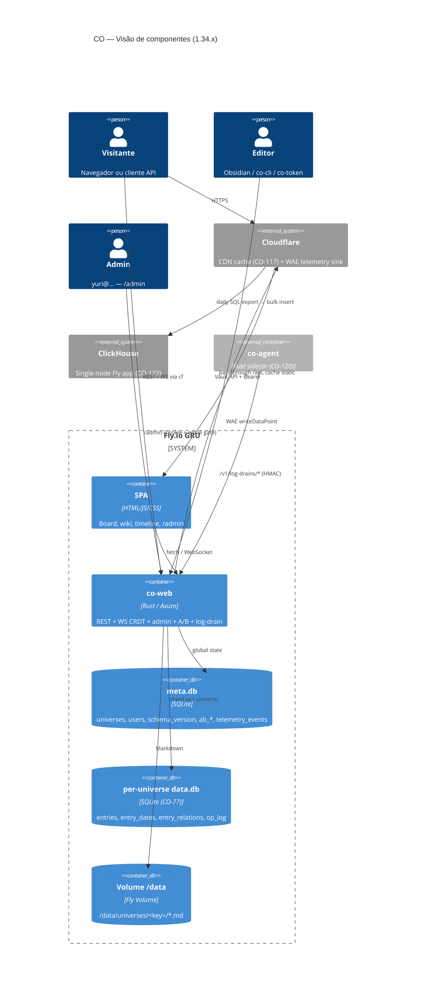

# Arquitetura — CO Platform

Este documento descreve como o CO funciona internamente: componentes, fluxo de dados e decisões de design da versão **1.34.x** (2026-05). Leia-o antes de contribuir com o servidor (`co-web`) ou entender como os dados trafegam entre cliente e armazenamento. Para rodar localmente, veja [ONBOARDING.md](ONBOARDING.md). Para operar em produção, veja [OPERATIONS.md](OPERATIONS.md).

> _English translation is welcome — open a PR._
>
> _Histórico: este documento foi originalmente escrito para 1.21.x. As seções "Evolução desde 1.21.x", "Armazenamento (1.23+)" e "Endpoints novos (1.22 → 1.34)" cobrem o delta._

---

## Em um instante

CO é uma plataforma de gestão de conteúdo baseada em grafo. Um **universo** é um namespace que agrupa **entradas** (arquivos Markdown com frontmatter YAML indexados no SQLite) e, opcionalmente, um quadro kanban. O servidor é um único binário Rust (`co-web`) que serve SPA + API REST + WebSocket CRDT.

A implantação canônica roda em uma máquina Fly.io (região GRU) com volume persistente em `/data`. O domínio `co.artelonga.com.br` está na frente do Cloudflare CDN (CO-117). O certificado Let's Encrypt é gerenciado automaticamente pelo Fly.io.

Não há microserviços, filas externas ou armazenamento em nuvem na arquitetura mínima. Um processo, um banco SQLite global (`meta.db`) + um banco por universo (`<universe>/data.db`, CO-77), um diretório de arquivos. Componentes opcionais (CO-104 backup-cron, CO-123 ClickHouse, CO-120 co-agent) ficam ao lado, conectáveis sem alterar o caminho síncrono.



---

## Fluxo de dados

| Ator | Autenticação | Como acessa |
|------|-------------|-------------|
| Visitante anônimo | sem cookie | Universos `template` e `public-static` — ReadOnly |
| Usuário autenticado | cookie `session=<JWT>` | `POST /api/v1/auth/password-login` ou link mágico por e-mail |
| API token | `Authorization: Bearer <token>` | Gerado via `POST /api/v1/auth/token`; usado pelo CLI e pelo plugin Obsidian |

Sessões JWT são assinadas com `JWT_SECRET`. Rotacionar o segredo invalida todas as sessões ativas (ver [OPERATIONS.md § 8](OPERATIONS.md)).

---

## Armazenamento de universos (1.23+)

CO-77 introduziu **sharding por universo**. Estado global vive em `meta.db`; conteúdo por universo vive em DBs separados:

```
/data/
  meta.db                       ← global: universes, users, schema_version,
                                  ab_assignments, ab_exposures, feature_flags,
                                  telemetry_events, log_drain_events
  meta.db-wal                   ← WAL pendente (snapshot precisa incluir)
  meta.db-shm                   ← shared memory marker
  auth.redb                     ← sessões + tokens API
  universes/
    <key>/
      data.db                   ← entries, entry_dates, entry_relations, op_log
      *.md                      ← fonte da verdade do conteúdo
      tasks/CO-NNN.md           ← (apenas universo 'co') ingest do dev board
  co/                           ← snapshot read-only de work/co/ (Phase E,
                                  refrescado a cada boot via copy_dir_all)
```

Leituras: o servidor abre conexões por universo via `universe_pool`. Escritas: a Vault API escreve no filesystem e em `data.db` daquele universo, mantendo `entries` como espelho pesquisável e `op_log` (CO-61) como trilha de mudanças.

**Por que a separação?** O lock do SQLite é por arquivo. Um universo grande sob carga não bloqueia o resto. Backup, snapshot e migração ficam escopados por universo. Replicação (LiteFS, CO-77) pode ser por universo no futuro.

### Migrações idempotentes (CO-137)

Toda `ALTER TABLE ADD COLUMN` em `run_migrations()` usa `ensure_column(conn, table, col, def)`. Toda `CREATE TABLE` usa `ensure_table(conn, name, sql)`. Ambos consultam `pragma_table_info` / `sqlite_master` antes de emitir DDL — re-executar uma migração parcialmente aplicada é seguro. Schema atual: **versão 28** (após CO-142 + CO-121).

`schema_version` usa `INSERT OR IGNORE` — uma linha v22 órfã (do incidente CO-137) não panica o binário no boot seguinte.

### Conteúdo arbitrário por universo (CO-71, CO-70)

A coluna `entries.payload` aceita JSON arbitrário. O manifesto `_universe.yaml` (CO-70) declara `content_types` com `fields[]`, `indexes[]`, `dates[]` (CO-73), `relations[]` (CO-74). O `IndexManager` materializa expression-indexes em `data.db` para os campos hot:

```sql
CREATE INDEX idx_co71_<universe>_<field>
  ON entries(universe_key, json_extract(payload, '$.<field>'));
```

Isto fornece performance de banco-relacional para campos quentes sem DDL em entrada do usuário.

---

## Sistema de temas

Temas são conjuntos de tokens CSS compilados em `co-web/src/theme_engine.rs`:

1. `ThemePreset::by_name(name)` retorna os tokens do tema.
2. `GET /api/v1/themes/<name>` devolve o CSS compilado diretamente (sem banco).
3. `GET /api/v1/universes/:slug/theme.css` devolve o preset salvo no universo + overlay `custom_tokens`.

Temas disponíveis: `modern`, `scholarly`, `scholarly-dark`, `relic`, `relic-light`, e outros. Ver `ThemePreset::all_presets()`.

---

## Modelo de acesso (CO-49)

Cada universo tem um campo `visibility`. A função `storage.check_universe_access(user_id, key)` retorna um `UniverseAccess`:

| Visibility | Anônimo | Dono | Membro editor | Membro viewer | Assinante | Logado (outros) |
|---|---|---|---|---|---|---|
| `template` / `public-static` | ReadOnly | ReadOnly | ReadOnly | ReadOnly | ReadOnly | ReadOnly |
| `public-subscribable` | MetadataOnly | ReadWrite | ReadWrite | ReadOnly | ReadOnly | MetadataOnly |
| `requires_login` | LoginRequired | ReadWrite | ReadWrite | ReadOnly | ReadOnly | ReadOnly |
| `private` | Denied | ReadWrite | ReadWrite | ReadOnly | Denied | Denied |

Universos criados sem login têm `owner_id` prefixado com `anon-` e `visibility = private`.

---

## Endpoints novos (1.22 → 1.34)

Categorias adicionadas desde 1.21.x:

| Prefixo | Ticket | Descrição |
|---------|--------|-----------|
| `/api/v1/admin/dashboard` + `/admin` | CO-105 (1.34.0) | Painel admin com agregados, gate JWT + email |
| `/api/v1/ab/*` | CO-121 (1.32.0) | Atribuição A/B + exposição (`feature_flags` etc.) |
| `/api/v1/log-drains/vercel` | CO-124 (1.33.x) | Receptor para Log Drains do Vercel — HMAC validado |
| `/api/v1/cache/*` | CO-79 | Métricas hit/miss/eviction do cache |
| `/api/v1/themes/<preset>` | CO-23 | CSS compilado por preset (sem banco) |
| `/api/v1/universes/<u>/theme.css` | CO-30 | Preset + overlay `custom_tokens` |
| `/api/v1/universes/<u>/entries/...` | CO-71 | Genérico — funciona para qualquer content_type |
| WS `/ws/universes/<u>/<path>` | CO-61 | CRDT Yrs por entrada |

## Componentes opcionais ao lado do servidor

- **co-agent** (CO-120, crate separado): sidecar Rust que coleta logs/eventos da app local e empurra para `co-web` via HMAC. Pode rodar como sidecar Fly, Cloudflare Worker tail, ou Vercel Log Drain (CO-124).
- **ClickHouse** (CO-123, app Fly separado `co-clickhouse`): banco OLAP single-node, consome export diário de WAE. Tabela `wae_events` com TTL de 90 dias. Schema preparado para Iceberg via `iceberg(...)` table function.
- **co-backup-cron** (CO-104, infra/backup-cron/): Alpine Fly app rodando crond a 03:17 UTC, snapshot diário para S3/R2. **Não deployado em prod ainda** — ver CO-143. Interim: `scripts/backup-prod-local.sh` captura para `~/co-backups/`.
- **Cloudflare** (CO-117): CDN na frente do Fly. Cache rules: estáticos cached, `/api/*` bypass, `Set-Cookie: session=` nunca cached.

## Evolução desde 1.21.x — atalhos para o que mudou

| Mudança | Versão | Onde olhar |
|---------|--------|------------|
| Per-universe SQLite + LiteFS | 1.23.0 (CO-77) | `storage.rs::Storage::new` rename co.db→meta.db; `universe_pool.rs` |
| Doc-generator hooks + job queue | 1.23.0 (CO-72) | `co-web/src/doc_gen.rs`, `job_queue.rs` |
| Per-universe schema validator + JSON payload | 1.24.0 (CO-71) | `core/src/manifest.rs::ContentType`, `co-web/src/index_manager.rs` |
| Manifest format `_universe.yaml` | 1.25.0 (CO-70) | `core/src/manifest.rs` |
| Remoção do git-sync legado | 1.26.0 (CO-64) | (refactor sem novos endpoints) |
| Modelo temporal `event_at`/`due_at`/etc | 1.27.0 (CO-73) | `core/src/manifest.rs::DateSemantic`; tabela `entry_dates` |
| Grafo de relações tipadas | 1.28.0 (CO-74) | `co-web/src/relation_index.rs`; tabela `entry_relations` |
| Sync protocol v1 + op log | 1.28.0 (CO-61) | `docs/sync-protocol-v1.md` |
| Backup automation | 1.28.0 (CO-104) | `scripts/backup-prod.sh`, `infra/backup-cron/` |
| A/B primitives | 1.32.0 (CO-121) | `co-web/src/ab.rs`, `ab_routes.rs` |
| ClickHouse + WAE export | 1.33.0 (CO-123) | `infra/clickhouse/`, `infra/clickhouse-export-cron/` |
| Admin dashboard | 1.34.0 (CO-105) | `co-web/src/admin_routes.rs` |
| Hierarquia de universos via `parent_key` | 1.22.0 (CO-98) | sidebar tree-build em `app.js::renderSidebar` |
| Conflict-resilient migrations | 1.22.5 (CO-137) | `storage.rs::ensure_column`, `ensure_table` |

## Service worker

`co-web/static/sw.js` — `CACHE_NAME = 'co-v4-offline'` (atualizado em 1.28.0 para CO-69 PWA offline):

| Recurso | Estratégia | Fallback |
|---------|-----------|---------|
| `/api/*` | Network-only | — |
| HTML / JS / CSS | Network-first | Cache (offline fallback) |
| Assets (imagens, fontes) | Cache-first | Network |

O SW detecta um novo `CACHE_NAME` na ativação, apaga caches antigos e força reload do cliente.

---

## Referências cruzadas

- Configuração local: [ONBOARDING.md](ONBOARDING.md)
- Deploy e operação: [OPERATIONS.md](OPERATIONS.md)
- Histórico de mudanças: [../CHANGELOG.md](../CHANGELOG.md)
- Protocolo de sincronização: [sync-protocol-v1.md](sync-protocol-v1.md)
