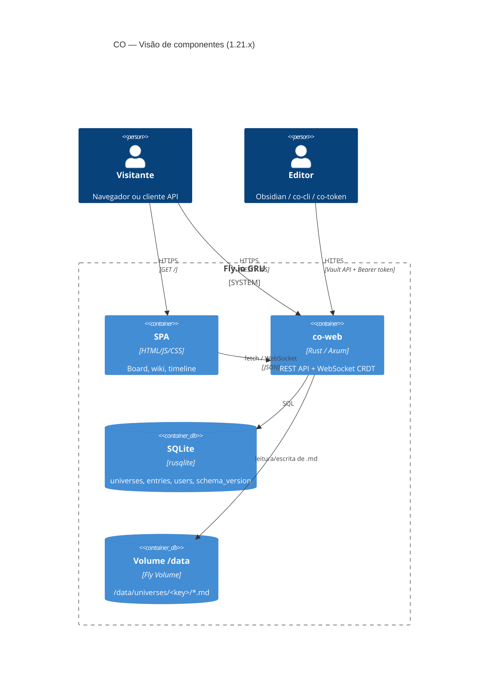

# Arquitetura — CO Platform

Este documento descreve como o CO funciona internamente: componentes, fluxo de dados e decisões de design da versão 1.21.x em diante. Leia-o antes de contribuir com o servidor (`co-web`) ou entender como os dados trafegam entre cliente e armazenamento. Para rodar localmente, veja [ONBOARDING.md](ONBOARDING.md). Para operar em produção, veja [OPERATIONS.md](OPERATIONS.md).

> _English translation is welcome — open a PR._

---

## Em um instante

CO é uma plataforma de gestão de conteúdo baseada em grafo. Um **universo** é um namespace que agrupa **entradas** (arquivos Markdown com frontmatter YAML indexados no SQLite) e, opcionalmente, um quadro kanban. O servidor é um único binário Rust (`co-web`) que serve SPA + API REST + WebSocket CRDT.

A implantação canônica roda em uma máquina Fly.io (região GRU) com volume persistente em `/data`. O domínio `co.artelonga.com.br` está na frente do Cloudflare CDN (CO-117). O certificado Let's Encrypt é gerenciado automaticamente pelo Fly.io.

Não há microserviços, filas externas ou armazenamento em nuvem. Um processo, um banco SQLite, um diretório de arquivos.



---

## Fluxo de dados

| Ator | Autenticação | Como acessa |
|------|-------------|-------------|
| Visitante anônimo | sem cookie | Universos `template` e `public-static` — ReadOnly |
| Usuário autenticado | cookie `session=<JWT>` | `POST /api/v1/auth/password-login` ou link mágico por e-mail |
| API token | `Authorization: Bearer <token>` | Gerado via `POST /api/v1/auth/token`; usado pelo CLI e pelo plugin Obsidian |

Sessões JWT são assinadas com `JWT_SECRET`. Rotacionar o segredo invalida todas as sessões ativas (ver [OPERATIONS.md § 8](OPERATIONS.md)).

---

## Armazenamento de universos

Cada universo tem uma linha no SQLite e um diretório no filesystem:

```
SQLite: universes  (key, name, owner_id, visibility, theme_preset, layout, parent_key)
Disco:  /data/universes/<key>/*.md          ← fonte da verdade
Índice: entries    (path, entry_type, title, tags, ...)  ← espelho pesquisável
```

O SQLite é reindexado automaticamente quando um arquivo muda via Vault API. Migrações ficam em `co-web/src/storage.rs::run_migrations()`; toda `ALTER TABLE ADD COLUMN` usa `ensure_column` (idempotente, CO-137). Schema atual: **versão 23**.

---

## Sistema de temas

Temas são conjuntos de tokens CSS compilados em `co-web/src/theme_engine.rs`:

1. `ThemePreset::by_name(name)` retorna os tokens do tema.
2. `GET /api/v1/themes/<name>` devolve o CSS compilado diretamente (sem banco).
3. `GET /api/v1/universes/:slug/theme.css` devolve o preset salvo no universo + overlay `custom_tokens`.

Temas disponíveis: `modern`, `scholarly`, `scholarly-dark`, `relic`, `relic-light`, e outros. Ver `ThemePreset::all_presets()`.

---

## Modelo de acesso (CO-49)

Cada universo tem um campo `visibility`. A função `storage.check_universe_access(user_id, key)` retorna um `UniverseAccess`:

| Visibility | Anônimo | Dono | Membro editor | Membro viewer | Assinante | Logado (outros) |
|---|---|---|---|---|---|---|
| `template` / `public-static` | ReadOnly | ReadOnly | ReadOnly | ReadOnly | ReadOnly | ReadOnly |
| `public-subscribable` | MetadataOnly | ReadWrite | ReadWrite | ReadOnly | ReadOnly | MetadataOnly |
| `requires_login` | LoginRequired | ReadWrite | ReadWrite | ReadOnly | ReadOnly | ReadOnly |
| `private` | Denied | ReadWrite | ReadWrite | ReadOnly | Denied | Denied |

Universos criados sem login têm `owner_id` prefixado com `anon-` e `visibility = private`.

---

## Service worker

`co-web/static/sw.js` — `CACHE_NAME = 'co-v3-network-first'`:

| Recurso | Estratégia | Fallback |
|---------|-----------|---------|
| `/api/*` | Network-only | — |
| HTML / JS / CSS | Network-first | Cache (offline fallback) |
| Assets (imagens, fontes) | Cache-first | Network |

O SW detecta um novo `CACHE_NAME` na ativação, apaga caches antigos e força reload do cliente.

---

## Referências cruzadas

- Configuração local: [ONBOARDING.md](ONBOARDING.md)
- Deploy e operação: [OPERATIONS.md](OPERATIONS.md)
- Histórico de mudanças: [../CHANGELOG.md](../CHANGELOG.md)
- Protocolo de sincronização: [sync-protocol-v1.md](sync-protocol-v1.md)
