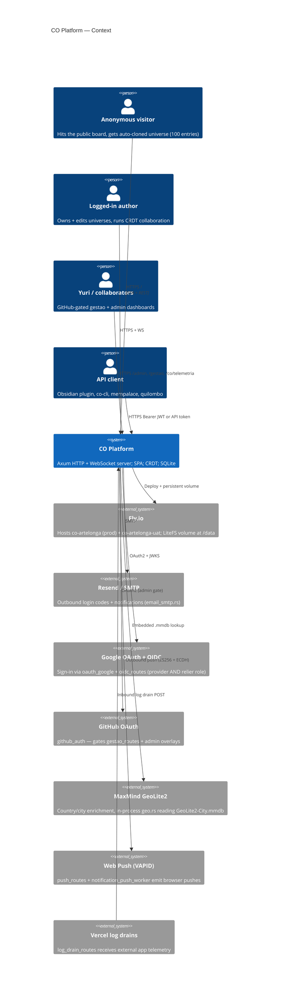
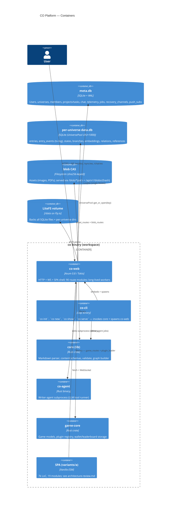
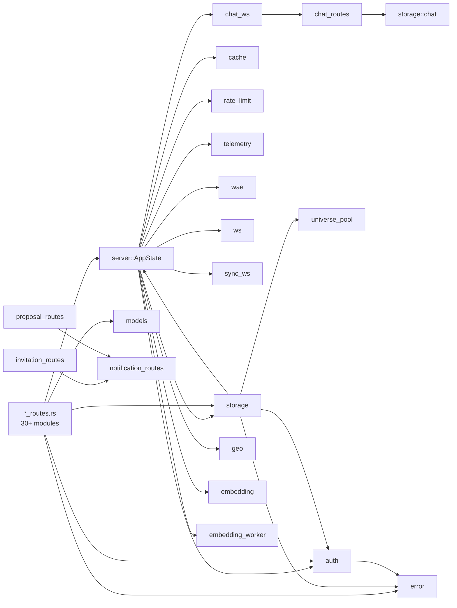

# CO — As-Is Architecture (C4)

**Snapshot:** 2026-05-13 · workspace 2.8.1
**Scope:** the four-binary workspace (`co-web`, `co-cli`, `co`, `co-agent`, `game-core`) plus the embedded SPA at `co-web/static/variants/a/`.
**Build on:** [`docs/architecture-review.md`](../architecture-review.md) already covers the SPA decomposition + the inject-callback IoC pattern; this document widens the lens to the Rust side and the platform context. The SPA section here defers to that review.
**Module patterns:** the five server-side patterns (directory, sub-state, extractor, event-bus, worker) are codified in [`co-web/src/MODULES.md`](../../co-web/src/MODULES.md).

---

## 1. C4 Context



CO is unusual in that it plays **both sides of OAuth/OIDC**: it consumes Google as an identity provider (`oauth_google.rs`) AND publishes its own OIDC provider surface (`oidc_routes.rs` + `/.well-known/openid-configuration` + JWKS) so quilombo + yggdrasil + artelonga.com.br can sign in *with* CO (CO-166/CO-205).

---

## 2. C4 Containers



**Key invariants** (see [`co-web/seed/co/public/transaction-log.md`](../../co-web/seed/co/public/transaction-log.md)):

- `entries` is the latest-snapshot view derived from `entry_events` (append-only log).
- `states/<ts>.md` are universe-wide checkpoints — Iceberg-style snapshots.
- `meta.db` is global (users, members, telemetry, jobs); each universe has its own `data.db` opened lazily through `UniversePool`.

---

## 3. C4 Components — inside `co-web`

```mermaid
graph TB
    subgraph EntryLayer["Entry layer"]
        srv[server.rs 1570 LoC<br/>build_router + AppStateInner]
        cfg[config.rs]
        err[error.rs]
        mdl[models.rs]
    end

    subgraph RouteModules["Route modules (HTTP surface — 30+ files)"]
        auth_r[auth_routes / auth_routes/auth_handlers<br/>auth_routes/legacy + static_files]
        univ_r[universe_routes 1265]
        entry_r[entry_routes 1372]
        vault_r[vault_routes 1519]
        ref_r[reference_routes 1469]
        chat_r[chat_routes 2063]
        dm_r[dm_routes 1143]
        prop_r[proposal_routes 1072]
        notif_r[notification_routes 976]
        inv_r[invitation_routes 1152]
        asset_r[asset_routes 944]
        blob_r[blob_routes]
        admin_r[admin_routes 879]
        gestao_r[gestao_routes 805]
        push_r[push_routes]
        rec_r[recovery_routes 1138]
        onb_r[onboarding_routes]
        oidc_r[oidc_routes 1037 + oauth_google]
        state_br[state_routes / branch_routes]
        rel_r[relation_routes / reference_routes]
        search_r[search_routes]
        webhook_r[webhook_routes]
        log_r[log_drain_routes]
        lead_r[lead_routes 952]
        ab_r[ab_routes]
        uat_r[uat_routes]
        proc_r[processos]
        tel_r[telemetry 1354 — also middleware]
        anly_r[analytics_public 1072]
        quil_r[quilombo_routes 1152 + quilombo_storage 1247]
        dev_r[dev_board]
        repl_r[repl_routes]
        sd_r[storage_dashboard]
        game_r[game_routes 923]
        sync_r[state_routes]
    end

    subgraph Sockets["WebSockets"]
        ws[ws.rs 828 — CRDT doc rooms]
        sws[sync_ws 1075 — SyncDelta protobuf]
        cws[chat_ws 1213 — chat fan-out + presence]
    end

    subgraph Workers["Background workers (tokio::spawn)"]
        emb_w[embedding_worker]
        wh_w[webhook_worker]
        np_w[notification_push_worker]
        ne_w[notification_email_worker]
        jq[job_queue]
        wae_w[wae emitter]
    end

    subgraph Storage["Storage layer (storage.rs + storage/*)"]
        st[Storage struct<br/>conn + universe_pool + data_dir]
        st_sub[storage/{api_tokens, chat, clone_ops, dashboard,<br/>data_migrate, invitations, log_drain, migrations,<br/>notifications, onboarding, projects, push_subscriptions,<br/>quilombo_bridge, recompute, schema, seed, subscriptions,<br/>tasks, universe, users} — 20 files]
        pool[universe_pool — LRU of Arc Mutex Connection]
        idx[entry_index / relation_index / reference_index / embedding_index]
    end

    subgraph CrossCutting["Cross-cutting"]
        auth_mw[auth — JWT ES256, gates, require_auth*]
        cache[cache.rs — LRU]
        rl[rate_limit]
        tel_mw[telemetry middleware]
        geo[geo.rs — MaxMind]
        wae[wae.rs — Workers Analytics Engine]
        plugin[plugin_loader]
    end

    srv --> RouteModules
    srv --> Sockets
    srv --> CrossCutting
    srv --> Storage
    RouteModules --> Storage
    RouteModules --> CrossCutting
    Sockets --> Storage
    Workers --> Storage
    chat_r --> cws
    notif_r --> np_w
    notif_r --> ne_w
    entry_r --> emb_w
    webhook_r --> wh_w
    asset_r --> blob_r
    inv_r --> notif_r
    prop_r --> notif_r
    auth_r -.session.- auth_mw
    univ_r --> idx
    entry_r --> idx
    ref_r --> idx
```

### Notable concentrations of complexity

| File | LoC | Smell |
|---|---|---|
| `server.rs` | 1570 | God-router + AppStateInner + handler defs + validators + UAT bootstrap + seed orchestration all in one file |
| `chat_routes.rs` | 2063 | Largest route module — rooms + members + messages + edit/delete + permission helpers |
| `vault_routes.rs` | 1519 | Obsidian-compat surface + clip + tags + search + tree + tokens |
| `reference_routes.rs` | 1469 | Reference cards + works + orphan-blobs + broken-cards |
| `entry_routes.rs` | 1372 | Manifest + query DSL + tags + tree + entries CRUD + similar + history |
| `telemetry.rs` | 1354 | Models + middleware + admin + ingestion + Plausible-style envelope all together |
| `chat_ws.rs` | 1213 | WS handler + room broadcast + presence + auth + delivery |

### Workers + their queues

| Worker | Trigger | Queue | Failure mode |
|---|---|---|---|
| `embedding_worker` | new/changed entry → `embedding_tx` channel | mpsc | drop on shutdown |
| `notification_push_worker` | `me/notifications` insert | DB polling | retries via `notifications` table state |
| `notification_email_worker` | same | DB polling | same |
| `webhook_worker` | outbound delivery row | DB polling + backoff | `webhook_deliveries` table |
| `job_queue` (`storage/jobs` derived) | `doc_gen`, `apply_template_all` | DB polling | row state machine |
| `wae` | every request that opts in | in-process buffer | drop if HTTP fails |

---

## 4. Rust dependency graph + cycles

Methodology: scanned `use crate::` across `co-web/src/*.rs`. The graph is mostly a star around two hubs — `server::AppState` and `storage::Storage`.



### Cycles detected

1. **`storage` ↔ `server`** (intentional but unfortunate): `storage.rs` imports `crate::server::AppState`, while `server.rs` owns `Storage` inside `AppStateInner`. This works because `AppState` is `Arc<AppStateInner>` and the cycle is at the **type-name** level (no actual recursive instantiation), but it makes `storage` not standalone-compilable into a sub-crate.
2. **Route module → `server::AppState` → route module** (implicit via Router): every `*_routes.rs` takes `State<AppState>` which pulls in *all* the per-tenant connections + the embedding service + the JWT key, even when the handler only needs the storage Mutex. Tight coupling, but not a build-time cycle.
3. **`chat_ws` ↔ `chat_routes`**: `chat_ws` reuses message-format helpers from `chat_routes`; if `chat_routes` ever wants to invalidate a WS room it would have to import `chat_ws` back. Not yet cyclic but on the path.
4. **`invitation_routes` → `notification_routes` → (indirectly via storage) → invitation rendering**: not a hard cycle today, but the inject-callback shape on the SPA side mirrors a coupling that's already present server-side — invitations/proposals/dms all emit notifications via direct function calls into a sibling route module rather than through a queue.

---

## 5. AppState — the IoC chokepoint

`AppStateInner` (server.rs:48-84) carries **18 fields**: storage Mutex + experiment Mutex + auth Mutex + mail trait object + 2 WS room managers + cache + rate limiter + WAE emitter + JWT key + embedding service + embedding sender + chat broadcast Mutex + chat presence Mutex + GeoDb + plugin registry + game storage + config. Every handler that takes `State<AppState>` gets *all* of it. This is the equivalent of the SPA's "inject-everything-into-every-module" pattern but at the type level.

---

## 6. SPA — see existing review

The SPA portion (700-line `app.js` orchestrator, 987-line `modals.js` god-file, callback-injection IoC) is fully covered in [`docs/architecture-review.md`](../architecture-review.md) §1–6. **Don't re-read it here.** This document only adds: the same shape exists on the Rust side (god-router + god-state), so the cross-stack fix is symmetric.

---

## 7. Open questions / unknowns

- `universo.rs`, `iceberg.rs`, `obsidian_tasks.rs`, `pretty_urls.rs`, `theme_engine.rs`, `embedding_index.rs`, `index_manager.rs`, `query_dsl.rs` — internal libraries used by routes, not surveyed in depth here. Worth a follow-up dependency-density pass.
- `co-deploy/`, `co-obsidian/`, `co-universes.yaml` sit outside the workspace `members` but inside the repo. Distribution story for those is not in this doc.
