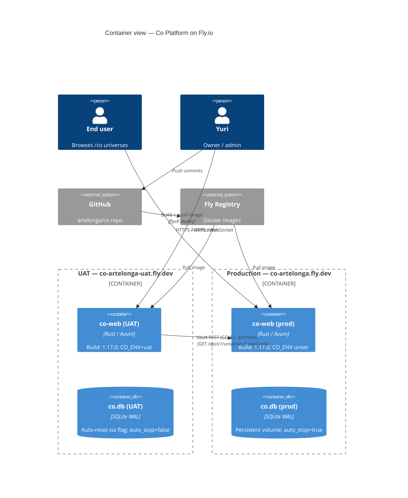

# Co Deployment

The platform runs on Fly.io with two environments — UAT for verification and prod for users. Both build from the same `artelonga/co` repo; UAT additionally pulls prod content on reset (CO-82, dormant by default).

## Notes

- The UAT → prod arrow is dormant until `UAT_MIRROR_PROD=true` and `UAT_PROD_TOKEN` are set as Fly secrets on `co-artelonga-uat`.
- Both environments deploy from the same Cargo.toml workspace version; `Cargo.toml` bumps land in one PR with the feature.
- Dev tooling (`co-auto`) lives in `dev/co-auto/` and is NOT part of either container — it's a developer's local binary.
