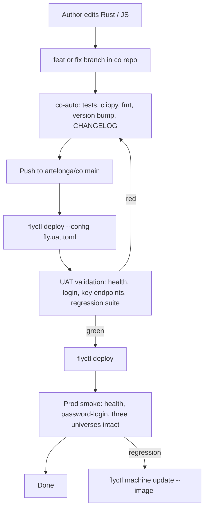
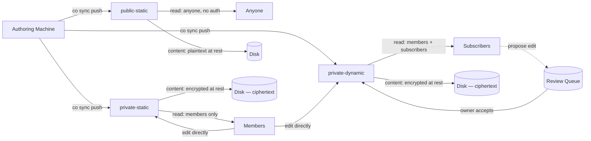
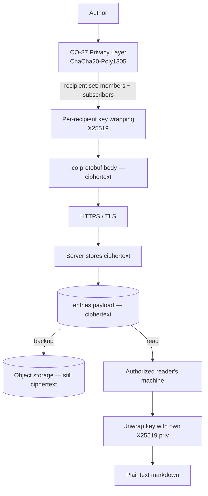

# Sync & deployment — systematic view

Two complementary flows keep the platform working: **sync** (content from author to deployed universe) and **deploy** (binary changes from source to running server). Universe content is decoupled from deploys — they can change independently.

## Sync flow (after-edit propagation)

```mermaid
sequenceDiagram
    autonumber
    participant Author as Author Machine
    participant Jj as jj
    participant Token as OS Keychain (co-token)
    participant Net as HTTPS / TLS
    participant Prod as Prod co-web
    participant Disk as /data volume

    Author->>Jj: edit .md → jj snapshots automatically
    Author->>Author: co sync push (CO-91)
    Jj-->>Author: jj diff <baseline>..@ — only changed *.md
    Author->>Token: co-token get prod (encrypted at rest, audited access)
    loop per changed file
        Author->>Author: encode .co (CO-86) — protobuf + optional zstd + optional encrypt
        Author->>Net: PUT /api/v1/universes/{key}/vault/{path} + Bearer
        Net->>Prod: TLS-decrypted request
        Prod->>Prod: vault_auth (JWT or API token)
        Prod->>Prod: parse_markdown_content; validate frontmatter
        Prod->>Disk: insert/update entries row + write body file
        Prod-->>Net: 200 OK
        Net-->>Author: response
    end
    Author->>Jj: jj log <baseline>..@ → automated changelog snippet
    Author->>Author: ~/.co/sync-runs/{universe}-{ts}.md
    Author->>Author: save new baseline = current jj commit
```

Key properties:
- **Idempotent.** Re-running pushes the same delta; vault PUT is upsert by path.
- **Throttled.** 1 sec/file to stay under prod's 60-req/min token budget.
- **Auditable.** Every sync run produces a changelog snippet on local disk.
- **Encrypted at rest** (after CO-86): the `.co` body bytes the server stores are ciphertext for private universes; the server cannot decrypt without recipient keys.

## Deployment routine



Universe content is on the `/data` Fly volume — separate from the binary. Deploys swap the binary, run startup migrations, and pick up where they left off. **No content is touched by a deploy.**

## Three universe types — access matrix



### Mapping today's `visibility` enum to the new model

| Today | After CO-93 |
|-------|-------------|
| `private` | `private-static` |
| `public-subscribable` (no proposals) | `public-static` |
| `public-subscribable` (with proposals enabled, future) | `private-dynamic` |
| `requires_login` | absorbed into `private-static` |
| `template` | special: system-owned `public-static` |

## Encryption layer (open-source codebase, private content)



The codebase can be open-sourced AND content stays private because:
- Encryption keys live on user devices (`co-token` keychain)
- Server only ever sees ciphertext
- Even backups are encrypted at the data-format level (not just at-rest disk encryption)
- Frontmatter stays plaintext for indexability (current trade-off)

This is the same model used by Standard Notes, Tutanota, ProtonMail, etc.

## What's static vs dynamic, mechanically

- **Static**: pre-rendered or rendered-on-read; no live editing surface for outsiders. Public-static can be cached at CDN edge. Private-static is auth-checked but otherwise serves the same flow.
- **Dynamic**: subscribers have a writable surface (the proposal queue). Edits queue, owner reviews, accepted edits become canonical. The flow is server-mediated; can't be CDN-cached.

The platform serves all three from the same Rust binary. Static-export to a separate CDN target is a Phase 4 enhancement (CO-93 spec).

## Where the dataflow goes wrong (failure modes)

| Failure | Effect | Recovery |
|---------|--------|----------|
| Author's machine is offline | `co sync push` fails locally; jj baseline unchanged | re-run when online; delta unchanged |
| Token revoked on prod | `co sync push` 401s | re-bootstrap to generate new token |
| Network slow / rate-limited | Some files fail with 429; partial sync | next run picks up the rest (delta excludes already-synced) |
| Server disk full | Vault PUTs fail; storage stays consistent | clear / scale, re-run |
| Encryption key lost on author's machine | Cannot decrypt own past content | depends on backup of keychain (separate concern) |
| Subscriber's recipient key compromised | Past content stays decryptable by attacker (forward-secrecy is hard) | rotate recipient set; re-encrypt going forward |

The encryption layer is the only place where **lost keys = lost content**. This is the cost of e2ee.
