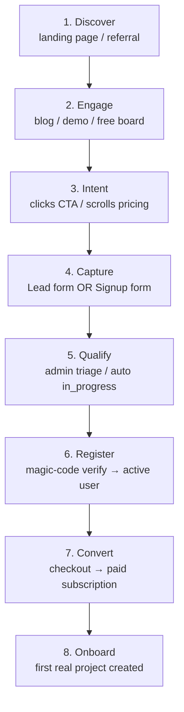

# Lead Acquisition Funnel

End-to-end journey from first visit to paid subscriber. Eight steps, two capture
paths (lead form + magic-code signup), unified at the email join key.

## 8-Step Funnel Diagram



## Per-Step Details

| Step | What the user does | What's wired | What observes it |
|------|-------------------|--------------|-----------------|
| 1. Discover | Visits landing page via organic/referral/ad | Static page served | WAE analytics `pageview` |
| 2. Engage | Reads content, tries the free board | SPA anonymous clone auto-created | WAE `board.load`, `entry.create` |
| 3. Intent | Clicks "Criar conta" or scrolls to pricing | — | WAE `cta.click` |
| 4. Capture — lead form | Submits `POST /api/v1/leads` | Lead row inserted; shell user created if email provided; `lead.captured` + `lead.user_linked` telemetry | Atividades audit log |
| 4. Capture — signup | Submits `POST /api/v1/auth/onboard-with-email` | Code sent (202); lead created in verify step | — |
| 5. Qualify | Verifies magic code (`/verify`) OR admin triages lead | Lead advances: `new → in_progress` (signup) or `new → triaged → in_progress` (lead form) | Atividades + `signup.captured` telemetry |
| 6. Register | Completes magic-code verify or activates shell account | `users.status = 'active'`; `users.activated_at` stamped | `auth.signup` + `auth.login` telemetry |
| 7. Convert | Pays (Stripe checkout) | — | CO-366 wires this step |
| 8. Onboard | Creates first real project / universe | First content entry | `entry.upsert` telemetry |

## Gap Analysis

Three gaps were identified in the 2026-06-05 funnel review:

| # | Gap | Status |
|---|-----|--------|
| 1 | Lead form and signup lived in separate tables with no cross-link | **Fixed in CO-370** — email is the join key; `leads.user_id ↔ users.lead_id` bidirectional FK |
| 2 | Conversion (step 7) not wired to leads | **Tracked in CO-366** — payment checkout will update lead status to `closed (won)` |
| 3 | Funnel drop-off report does not exist | **Tracked in CO-371** — consumes the CO-370 unified identity to produce per-step metrics |

## KPIs

| Metric | Definition | Source |
|--------|-----------|--------|
| `t_landing` | Time of first `pageview` event | WAE analytics |
| `intent_rate` | CTA clicks / unique visitors | WAE |
| `capture_rate` | Leads created / CTA clicks | `leads` table count |
| `verify_rate` | Users with `activated_at` / leads with `user_id` | `users JOIN leads` |
| `t_register` | `users.activated_at - leads.created_at` | SQL diff |
| `conversion` | Paid subscribers / registered users | CO-366 + `users.tier` |
| `qualify_SLA` | Median time `new → in_progress` per admin | `leads.updated_at - leads.created_at` WHERE status = 'in_progress' |

## Unified Identity Model (CO-370)

Two write paths, one identity — email is the join key:

```
leads
  ├── id          (INTEGER PK)
  ├── email       (TEXT — join key, lowercased + trimmed)
  ├── source      (lead_form | signup | invitation | manual)
  ├── status      (new → triaged → in_progress → closed)
  └── user_id →──┐
                  │
users ←───────────┘
  ├── id          (TEXT PK, "usr_<nanoid>")
  ├── email       (TEXT UNIQUE — mirrors leads.email)
  ├── status      (active | pre-registered | suspended)
  ├── activated_at (TEXT — NULL until email verified)
  └── lead_id →── leads.id
```

### Lead form path (`POST /api/v1/leads`)

1. Insert lead row (`source = 'lead_form'`).
2. If `email` provided:
   - Find existing user by email → link `leads.user_id`, `users.lead_id`.
   - If no user exists → create shell user (`status = 'pre-registered'`) and link.
3. Emit `lead.captured` + `lead.user_linked` telemetry.

### Signup path (`POST /api/v1/auth/onboard-with-email/verify`)

1. Create user (`status = 'active'`, `activated_at = now`).
2. Insert lead (`source = 'signup'`, `status = 'new'`) if none exists for email.
3. Immediately advance lead to `status = 'in_progress'` (user self-qualified).
4. Link bidirectional FKs.
5. Emit `signup.captured` + `auth.signup` + `auth.login` telemetry.

### Shell user activation

When a pre-registered shell user later verifies their magic code:
- `users.status` → `'active'`
- `users.activated_at` → now
- Lead does **not** auto-advance (admin triages `lead_form` leads manually).

## Cross-References

- **CO-371** — Funnel report: consumes `leads JOIN users` to produce per-step drop-off metrics.
- **CO-366** — Payment wiring: closes step 7 (Convert) by updating lead status on successful checkout.
- **CO-183** — Lead state machine (shipped): `new → triaged → in_progress → closed` transitions.
- **CO-190** — Passwordless onboarding (shipped): magic-code signup flow extended in CO-370.
