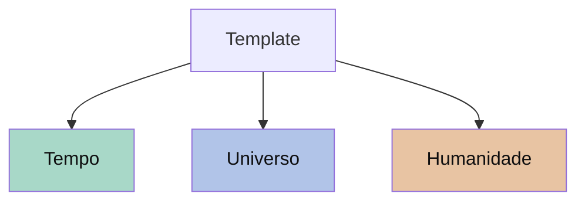

GIVEN `co-web/static/shared/markdown.js::renderMermaidBlocks` already lazy-loads Mermaid and post-processes any `\`\`\`mermaid` block in rendered output (CO-83, shipped 1.19.x), AND the new `renderUniverseHome` function (1.20.11) renders `index.md` as the universe front page but does NOT call the Mermaid post-processor, AND we want template's home page to include a Mermaid diagram of the timeline trio (`template → tempo, universo, humanity`) for the launch demo,
WHEN we wire `renderMermaidBlocks` into `renderUniverseHome` after the markdown renders, AND embed a sample Mermaid diagram in `co-web/seed/timeline/tempo-index.md`,
THEN the universe-home becomes a content surface where authors can communicate structure (component diagrams, ER, flowcharts) inline, matching the existing capability of the kanban / conteudo views.

## Implementation

In `co-web/static/variants/a/app.js::renderUniverseHome`:

```js
// After body.innerHTML = ... (rendered markdown):
if (window.CoMarkdown && typeof window.CoMarkdown.renderMermaidBlocks === 'function') {
    window.CoMarkdown.renderMermaidBlocks(body);
}
```

That's it on the SPA side — the helper already handles lazy bundle load, theme-awareness via CSS vars, and idempotency.

## Sample diagram in template's home

Add to `co-web/seed/template/sobre.md` (or a new dedicated section):

````markdown
## Universos curados


````

Colors match the timeline.html palette — the diagram and the timeline view feel coherent.

## Acceptance

- [ ] `renderUniverseHome` calls `renderMermaidBlocks(body)` after rendering markdown.
- [ ] Lazy bundle load happens on first universe-home render that includes a `mermaid` fence; subsequent renders reuse it.
- [ ] Template's home page (`co.artelonga.com.br/co`) renders the timeline trio diagram correctly.
- [ ] No regression on universes whose `index.md` has no Mermaid block (no extra network request, no errors).
- [ ] Diagram renders in dark mode (relic / scholarly-dark) without contrast issues.
- [ ] Playwright test: load `/co`, wait for diagram, assert `<svg>` rendered inside `.universe-home-md`.

## Constraints

- Don't bundle Mermaid eagerly. Existing lazy-load is correct — keep it.
- Don't replace the markdown renderer. The Mermaid step is post-processing on already-rendered HTML.
- Theme integration: the existing helper reads CSS vars (`--accent`, `--bg`, etc.) — diagrams adapt automatically when the user changes palette.

## Out of scope

- Mermaid diagrams in conteudo cards (already supported via the standard markdown renderer — verify with a quick smoke).
- Custom Mermaid themes per universe (defer until plugin system in CO-63).
- C4 model preset (Mermaid supports it natively; no extra config needed).

## Related

- `work/co/SPRINT-V1-LAUNCH.md` — Wave 2 task B3.
- `work/co/CO-83.md` — Mermaid renderer (shipped). This ticket consumes it on a new surface.
- `work/co/CO-98.md` — hierarchical universes; once shipped, the diagram could be auto-generated from the parent_key tree instead of hard-coded.
