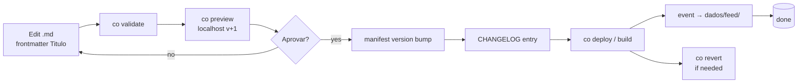

## As

a CO user who wants a single private surface that summarizes activity across every universe I touch — **and** a structured way to perform reviewable, deploy-tracked changes (e.g. "change the website title")

## I Need

(a) every signed-up user gets a private universe with key = `users.username`, and inside that universe a `dados/` sub-section that aggregates stats across all universes the user has access to (with cross-universe correlations), AND (b) a first-class **process** content type at `Co/processos/<process>` that documents the deterministic source→sink chain for repeatable atomic changes (markdown edit → localhost preview at v+1 → approval → prod deploy → CHANGELOG entry → telemetry event in the user's `dados/`)

## To

deliver the dashboard interactivity AND the structured-change pattern the user described on 2026-05-02:
- "it works like a dashboard, changing a file in other universes or adding a new universe populates that, obviously one (private) per user, and also include the private yuri user (always use slug as user name by default)"
- "what we want is a per-user dados pannel that can even be inside their own private repo, so yuri/dados would show all stats for all universes and possibly cross stats"
- "change .md under projetos to Titulo, then show a Alterar titulo process that shows the deterministic chain: edit markdown, review in localhost (should open a server with the change proposed as v+1), if approved deploy to production. these events should be logged and accessible via dados, as atomic changes (eg version bump) with a changelog entry and explanation of request source to sink, show how data is syncd and all this should be available under Co/processos/alterar pagina na web"

---

## Architecture

```
Per-user personal universe (private, key = users.username)
└── dados/                        ← dashboard sub-section (NEW pattern)
    ├── universos/<key>.md        ← stats per universe the user has access to
    ├── feed/YYYY-MM-DD.md        ← daily activity log (entries, deploys, edits)
    ├── cross/                    ← cross-universe correlations (new universe
    │                               + activity bursts + parent-child rolls)
    ├── dispositivos/             ← devices/browsers/sessions
    └── processos/                ← user-scoped instance of Co/processos/
        └── <process-name>/runs/  ← run history + outcomes
                                  
Co universe (system-owned, public-subscribable)
└── processos/                    ← canonical process catalog (NEW)
    ├── alterar-pagina-na-web.md  ← worked example
    ├── publicar-novo-universo.md ← future
    └── rotacionar-secret.md      ← future
```

The user's slug-keyed personal universe (`yuri`, etc.) is the **single source of truth** for that user's view of CO. The `dados/` sub-section is filled by the activity-feed pipeline. The `processos/` sub-section records per-user instances of the canonical processes catalogued in `co/processos/`.

This pattern is universe-as-repo-friendly (CO-50): a user's personal universe can be backed by their own git repo, and `dados/` content stays inside their domain.

---

## Phase A — auto-create per-user personal universe + dados/ skeleton

### Trigger points

- `POST /api/v1/auth/password-login` (signup branch)
- Magic-link verify (`POST /api/v1/auth/verify`)
- Admin seed path (already done for `yuri` via `PERSONAL_KEYS` + `ensure_admin_username` + `ensure_admin_owns_personal_universes` in 1.34.6/7)
- UAT-only `POST /api/v1/auth/uat-login` first-call

### Function shape

```rust
/// Idempotent: creates a private universe with key = username (owned by
/// user_id) and seeds the dados/ skeleton (universos/, feed/, cross/,
/// dispositivos/, processos/).
pub fn ensure_user_personal_universe(
    &mut self,
    user_id: &str,
    username: &str,
) -> anyhow::Result<bool> { ... }
```

### Acceptance

- New user signup → private universe at `<username>` with `dados/` subdir scaffolded
- Idempotent on every boot
- Username conflict gracefully skipped (per `ensure_admin_username` pattern)

---

## Phase B — cross-universe activity feed populating dados/

### Source: `upsert_entry_row` event hook

Every entry write across the system emits one event:

```json
{
  "type": "entry.upsert",
  "timestamp": "2026-05-02T...Z",
  "universe_key": "<source>",
  "entry_path": "...",
  "entry_type": "task | page | event | clip | ...",
  "title": "...",
  "actor_id": "<user_id>",
  "diff_summary": { "field": "status", "from": "todo", "to": "done" }
}
```

### Two consumers

1. **Global `dados` system universe** — appends to `dados/feed/YYYY-MM-DD.md` for ANY universe write. Read by admins.
2. **Per-user `<username>/dados/feed/YYYY-MM-DD.md`** — only events for universes the user owns / is member of / subscribes to.

### Cross-universe correlations (`<username>/dados/cross/`)

Distinct from the raw feed — derived stats:

- `cross/parent-child-flow.md` — when a child universe (CO-98 hierarchy) updates, the parent's roll-up reflects it
- `cross/burst.md` — N writes within T minutes across ≥2 universes the user touches → flagged as a "session"
- `cross/onboarding.md` — first-time-creating-a-universe, first-public-subscription, etc.

### Implementation note

The existing `telemetry_events` table (CO-46) already captures most of this. Phase B can be a periodic translator: every 60s (or on-demand), turn unread `telemetry_events` rows into markdown lines in the appropriate dashboard universes. Avoids the extra-write-per-write cost of a synchronous hook.

### Privacy

- Event payload carries IDs, types, titles — no body content (per `feedback_migration_column_reads.md` privacy boundary doctrine)
- Per-user feed filters by access — a user never sees activity from universes they don't have access to

---

## Phase C — Process model: `Co/processos/<process>`

### The "deterministic chain" pattern

A **process** is a content type that documents a repeatable atomic change. Each process spec defines:

1. **Trigger** — what initiates it (file edit, button click, scheduled job)
2. **Source** — what gets changed (e.g. `<universe>/projetos/<page>.md`'s `Titulo` field)
3. **Review** — how the change is previewed (localhost server at `v+1`, side-by-side diff)
4. **Approval** — gate condition (manual click, auto-approve if tests pass, etc.)
5. **Sink** — where it lands (prod deploy, version bump, S3 upload)
6. **Telemetry** — what events get emitted (recorded in `dados/feed/`)
7. **Rollback** — how to undo (revert commit, re-deploy previous tag)

### Worked example: `Co/processos/alterar-pagina-na-web`

Documents the process for changing a website page's title (or any field):

```
1. TRIGGER — User edits Titulo field on .md under projetos/ in a universe
             (e.g., my-site/projetos/index.md sets `Titulo: "Hello World"`)

2. SOURCE   — The frontmatter field `Titulo` of the entry

3. REVIEW   — `co preview` opens a localhost server (port 8741+) serving the
             universe at version v+1 (the proposed change). The user sees
             the rendered page. The diff is shown in a side panel.

4. APPROVAL — User clicks "Aprovar" in the preview UI. Or `co preview --approve`
             from CLI. CI checks (link validation, broken-image scan) gate
             this if the manifest declares them.

5. SINK     — `co deploy` (or POST /api/v1/processos/alterar-pagina-na-web/run):
             - bumps the universe's manifest version (semver patch by default)
             - writes a CHANGELOG entry under universe-root CHANGELOG.md
             - flytcl deploy or static-site rebuild runs
             - emits telemetry event:
               { type: "process.alterar-pagina-na-web.completed",
                 universe: "...", page: "...",
                 from_title: "...", to_title: "...",
                 from_version: "1.5.2", to_version: "1.5.3",
                 actor_id: "..." }

6. TELEMETRY — Event lands in:
             - <username>/dados/feed/YYYY-MM-DD.md (per-user)
             - <universe>/CHANGELOG.md (per-universe)
             - dados/feed/ (system-wide if public)

7. ROLLBACK — `co revert <version>` or PUT /api/v1/processos/alterar-pagina-
             na-web/runs/<id>/revert restores prior manifest + redeploys.
             Same chain, inverse direction. Logged.
```

### Source → Sink visualization (Mermaid in the entry body)



### Why a content type, not just a script

A **process is content** — it lives in markdown like everything else, with frontmatter declaring the trigger/source/sink shape. This means:

- Discoverable via `co/processos/` listing in the SPA
- Versionable like any entry (every change is a content edit)
- Translatable / forkable per universe (a private universe can override `alterar-pagina-na-web` with custom approval logic)
- The process catalog itself participates in the deterministic chain — editing `co/processos/alterar-pagina-na-web.md` triggers the SAME flow

### Initial process catalog seed (committed in this ticket)

- `co/processos/alterar-pagina-na-web.md` — the worked example above
- (later, separate tickets:)
  - `co/processos/publicar-novo-universo.md`
  - `co/processos/rotacionar-secret.md`
  - `co/processos/promover-universo-uat-to-prod.md`

---

## Phase D — SPA rendering

### `<username>/dados/` view

Uses the existing `renderDashboard` view in `app.js` — extend with:

- "Universos" sparkline grid (one mini-chart per universe-key the user has access to)
- "Feed" reverse-chronological pane fed by `dados/feed/YYYY-MM-DD.md`
- "Cross" panel showing correlations (parent-child rolls, bursts, onboarding milestones)
- Universe / actor / entry-type filters

### `Co/processos/<process>` view

Uses the standard entry view, but:

- Detect `entry_type: "process"` in frontmatter
- Render the trigger/source/review/approval/sink/telemetry/rollback sections as a structured stepper
- Show the Mermaid source→sink diagram inline
- "Run this process" button when the user has access to the target universe — opens the appropriate input form (e.g. for `alterar-pagina-na-web`, picks a page, opens an inline editor)
- "History" tab listing `<universe>/dados/processos/<process>/runs/` (per-user run history)

---

## Acceptance

### Phase A
- [ ] `ensure_user_personal_universe(user_id, username)` exists in `co-web/src/storage.rs`
- [ ] Wired to all four signup paths (password, magic-link, UAT, admin-seed)
- [ ] Idempotent — re-call on boot is a no-op (uses ensure-pattern, not insert-fail-if-exists)
- [ ] Username conflict logged + skipped (does not break signup)
- [ ] Personal universe gets `dados/` subdir with `universos/`, `feed/`, `cross/`, `dispositivos/`, `processos/` skeleton entries
- [ ] Tests cover: new signup → universe + skeleton; pre-existing → no overwrite

### Phase B
- [ ] `upsert_entry_row` (or a periodic translator) emits cross-universe events
- [ ] Each event materializes into BOTH `dados/feed/YYYY-MM-DD.md` (global, when applicable) AND `<username>/dados/feed/YYYY-MM-DD.md` (per-user, filtered by access)
- [ ] Cross-universe correlations populate `<username>/dados/cross/` (parent-child rolls, bursts, onboarding milestones)
- [ ] Privacy: no body content in event payload, only metadata
- [ ] Per-user feed access-checked: a user only sees events from universes they have access to

### Phase C
- [ ] `co/processos/alterar-pagina-na-web.md` committed at `work/co/processos/` (deployed via the seed-co bundle)
- [ ] New entry_type `process` registered in the manifest
- [ ] The process spec body contains: Trigger, Source, Review, Approval, Sink, Telemetry, Rollback sections + a Mermaid source→sink diagram
- [ ] CLI commands `co preview`, `co preview --approve`, `co deploy`, `co revert` either implemented OR explicitly stubbed with "not yet implemented; see CO-145" pointers
- [ ] At least one end-to-end run of `alterar-pagina-na-web` against a test universe completes the chain and writes events to all three sinks (`<universe>/CHANGELOG.md`, `dados/feed/`, `<username>/dados/feed/`)

### Phase D
- [ ] `<username>/dados/` renders as a Painel-style dashboard
- [ ] `Co/processos/<process>` entries render with the structured stepper + Mermaid diagram + "Run this process" button
- [ ] Per-user run history (`<username>/dados/processos/<process>/runs/`) shows timestamps + outcomes

---

## Out of scope

- Real-time WebSocket push for the activity feed (Phase 1 polls / refreshes on navigation)
- Cross-account dashboards (admin views all users' feeds) — separate ticket
- Activity events for non-entry actions (theme changes, member adds) — Phase 2
- Encryption at rest (CO-86 envelope) — Phase 4 platform-plan territory
- Process catalog beyond the worked example (`publicar-novo-universo`, `rotacionar-secret`, etc.) — file as separate tickets per process

---

## Decision log

- **`dados` stays system-owned (global aggregate).** Per-user dashboards live inside `<username>/dados/`. Two distinct surfaces.
- **Personal universe key = `users.username`.** "Always use slug as user name by default" → derive from email-prefix on signup if username is empty.
- **`processo` is a content type, not a script.** Lives as markdown in `co/processos/`, versionable like any entry.
- **The same deterministic chain applies to the process catalog itself** — editing `co/processos/<x>.md` triggers `alterar-pagina-na-web` (or a meta-equivalent) recursively. The system is reflexive.

---

## Related

- 1.34.6 / 1.34.7 commits — admin's `yuri` personal universe re-homed; admin username = `yuri`
- `dados` system universe — exists with `universos/`, `dispositivos/` content shape (currently static)
- CO-46 — telemetry_events table (event source for Phase B's translator)
- CO-50 — universe-as-repo (private universe can be backed by user's git repo, dados/ stays inside their domain)
- CO-98 — hierarchical universes (`parent_key`); cross-universe correlations leverage this
- CO-105 — admin telemetry dashboard (different surface; CO-144 is per-user + process-aware)
- CO-91 — `co sync` (the deploy step in `alterar-pagina-na-web` chains into this)
- CO-86 — `.co` envelope format (Phase 4); per-user `dados/` will encrypt at-rest under user key when CO-86 ships
