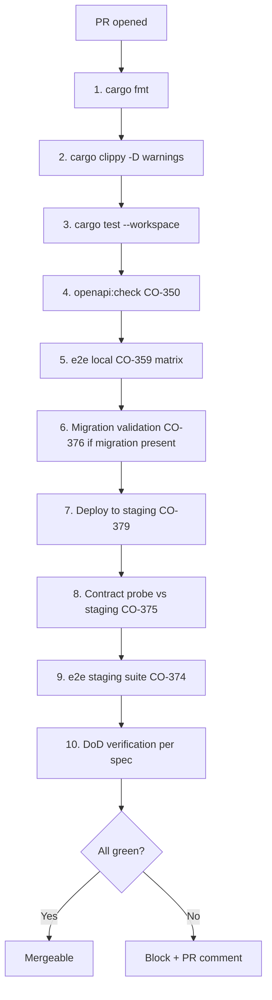

## As
The operator running scrum on top of CO

## I Need
A scrum-aligned CI/CD pipeline where every task (feat / fix / refactor / chore) follows a deterministic route, each step verifiable against the spec's `## Acceptance` checklist, with release tags fired only when every PR in the wave has green DoD verification.

## So That
- The scrum process from CO-368 has teeth: DoD becomes a CI gate, not just documentation.
- A merged PR with unchecked acceptance items is impossible.
- The sprint review (CO-372) automatically pulls real DoD percentages.
- Wave 4's 20 PRs converge predictably; v3.0 release fires only when all DoD green.
- The "deterministic route per task with DoD criteria before release" requirement (2026-06-06) is met.

## Design

### The deterministic route — what every PR runs



Each PR opened gets a "DoD Status" check that aggregates the 10 steps.

### DoD verification — how it works

For PR with title `CO-N — ...`:
1. Read `work/co/CO-N.md`
2. Parse `## Acceptance` checklist items (each `- [ ]` line)
3. For each item, derive a test name pattern:
   - "btn-compor opens compose modal" → `test.*compose.*modal|btn-compor`
   - "Anonymous user gets login CTA" → `test.*anon.*login|login.*cta`
4. Search the PR's added/modified test files for matching test cases
5. Run the matched tests; emit per-item ✅ or ❌
6. Post DoD table as PR comment
7. Block merge if any item ❌

Generator helper `scripts/dod/verify.ts` does steps 1-7.

### Auto-generation of test stubs

For specs that don't yet have matching tests, generator emits stubs:

```typescript
// e2e-generated/co-352-dod.spec.ts
import { test, expect } from "@playwright/test";

test.describe("CO-352 DoD", () => {
  test("[acceptance] /u/comunicacao/sala renders the spatial canvas", async ({ page }) => {
    // TODO: implement
    test.fixme();
  });
  test("[acceptance] btn-compor opens compose modal", async ({ page }) => {
    test.fixme();
  });
});
```

Dev fills the `// TODO`s during PR work. CI counts `fixme()`s — wave's DoD goal = all `fixme()` removed before release.

### Sprint integration (CO-368/372)

The Sprint Review (Thursday 15:00 BRT) automatically pulls:
- Per PBI: DoD % from this spec's verification output
- Per sprint: average DoD %, total PBIs delivered, carried-over count
- Velocity chart updates with verified DoD counts (not just merged PR counts)

`scripts/scrum/sprint-review.ts` reads CO-382's DoD JSON outputs and writes `docs/scrum/sprints/sprint-<N>.md`.

### Release gate

`scripts/release-commit.sh` extension:
1. Read all PRs merged since last tag
2. For each: query its DoD JSON output
3. If any PR has DoD < 100%, refuse release
4. Override flag: `--ignore-dod` for emergency hotfixes (logged + alerted)

### The 10-step route — implementation

| Step | Owner | Cost | Blocks merge? |
|---|---|---|---|
| 1. cargo fmt | local + CI | <5s | yes |
| 2. cargo clippy -D warnings | CI | ~30s | yes |
| 3. cargo test --workspace | CI | ~3min | yes |
| 4. openapi:check (CO-350) | CI | <5s | yes |
| 5. e2e local matrix | CI | ~5min | yes |
| 6. Migration validation (CO-376) | CI (only if migration) | ~30s | yes |
| 7. Deploy to staging (CO-379) | CI after merge to main | ~3min | n/a (post-merge) |
| 8. Contract probe vs staging (CO-375) | CI after staging deploy | ~30s | n/a (post-merge) |
| 9. e2e staging suite (CO-374) | CI after staging deploy | ~10min | n/a (post-merge) |
| 10. DoD verification (this spec) | CI per PR + per release | ~30s/PR | yes |

Steps 1-6, 10 block merge. Steps 7-9 block release (next Thursday).

### GitHub Actions wiring

Three workflows:
- `.github/workflows/pr-route.yml` — runs steps 1-6, 10 on every PR
- `.github/workflows/staging-suite.yml` — runs steps 7-9 on push to main
- `.github/workflows/release-gate.yml` — runs Thursday 14:00 BRT, validates all PRs in wave have green DoD, blocks 15:00 release-commit if not

### Telemetry

Per CO-380 event bus (now generalized):
- `event_type = ci.step.{passed,failed}` per step
- `event_type = ci.dod.verified` per spec
- `event_type = release.gate.{passed,blocked}` per wave

Surfaces in CO-381 live timeline as "🛠️ Migration validation passed for CO-352" etc.

### Sprint Review auto-generation

Thursday 14:30 BRT (30 min before release):
1. Run `scripts/scrum/sprint-review.ts`
2. Output: per-PBI DoD %, velocity, carried-over, sprint goal vs reality
3. Commits `docs/scrum/sprints/sprint-<N>.md` with metrics
4. Posts to atividades feed (visible in /agora live timeline)

## Acceptance

- [ ] PR with title `CO-N — ...` triggers DoD verification workflow
- [ ] `## Acceptance` items parsed from spec
- [ ] Each item mapped to a test pattern; matching tests executed
- [ ] DoD table posted as PR comment with per-item ✅/❌
- [ ] Merge blocked if any acceptance item is ❌
- [ ] `scripts/dod/verify.ts` generates `e2e-generated/CO-N-dod.spec.ts` stubs
- [ ] `scripts/scrum/sprint-review.ts` runs Thursday 14:30 BRT + commits sprint review
- [ ] `scripts/release-commit.sh` refuses release if any wave PR has DoD < 100%
- [ ] `--ignore-dod` override flag exists (emergency only, logged)
- [ ] CO-380 event bus captures `ci.*` and `release.gate.*` events
- [ ] Live timeline (CO-381) renders CI events with 🛠️ icon
- [ ] OpenAPI documents the new CI events
- [ ] All 10 route steps implemented + documented in `docs/ci-route.md`

## Blast radius

- ~250 lines `scripts/dod/verify.ts` (parse + match + run)
- ~150 lines `scripts/scrum/sprint-review.ts`
- ~80 lines `scripts/release-commit.sh` extension
- ~120 lines 3 new GitHub Actions
- ~100 lines `docs/ci-route.md` + `docs/dod-verification.md`
- ~80 lines unit + integration tests
- 0 schema migrations
- 0 production code changes (CI-only)

## Dependencies

- CO-368 (Wave 3 ✓ if landed) — scrum entry types provide PBI/Sprint structure
- CO-369 ✓ shipped — acceptance parsing precedent
- CO-372 (Wave 5) — sprint calendar surfaces the metrics
- CO-374 (Wave 4) — Playwright suite executes the matched tests
- CO-380 (Wave 4) — event bus for CI/release events

## Not in scope

- **AI-assisted DoD authoring** (suggest acceptance items from PR diff) — defer
- **Cross-spec dependency tracking** (CO-X DoD depends on CO-Y) — defer
- **Story-point velocity prediction** — defer
- **Per-developer scorecard** — privacy concern, defer
- **Test execution time budgets** per acceptance item — defer
- **Manual DoD override at item level** (just whole-PR) — defer
- **DoD verification on already-merged PRs** (retroactive) — CO-369 retro covers it
