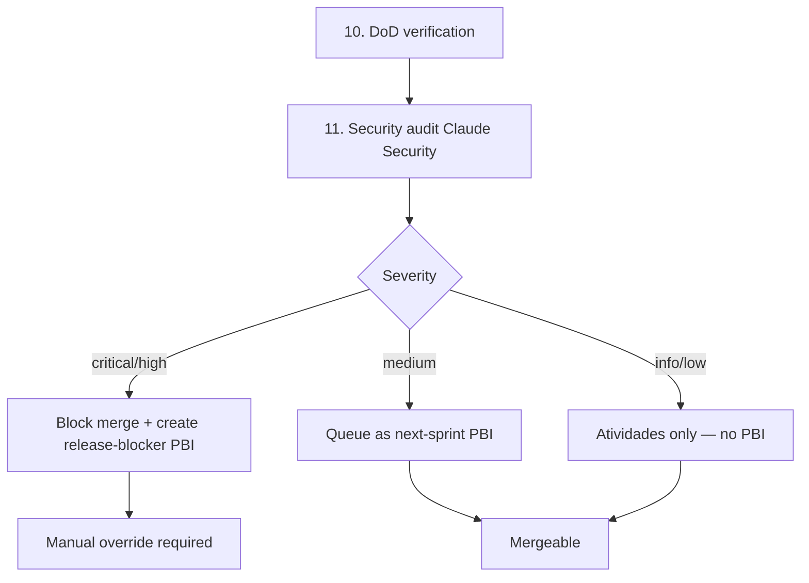

## As
Yuri running CO as the bounded service for many brains, in a world where cyber-capable models are around the corner

## I Need
A pre-release vulnerability scan integrated as step 11 of CO-382's deterministic CI route. Claude Security (or equivalent) scans the codebase on every PR; findings flow through the event bus, land as PBIs in the sprint backlog, surface in `/agora` live timeline, and gate the release via DoD verification.

## So That
- CO adopts Project Glasswing's posture early — defenders ahead of attackers via early integration.
- The bottleneck Anthropic identified ("verifying, disclosing, patching") rides CO's existing scrum CI spine (CO-382) instead of becoming a separate process.
- High-severity findings BLOCK release; medium become next-sprint PBIs; informational becomes audit-only.
- CO's own codebase (Rust + TypeScript + SQL) gets the same defender-advantage that Anthropic is extending to ~150 partner orgs.
- When/if CO grows to serve 100M+ people (per the IaaS thesis), the operational muscle for security review already exists.

## Context

Anthropic's 2026-06-02 announcement: Project Glasswing partners deploy Claude Mythos Preview to scan codebases for vulnerabilities. They've found >10,000 high/critical findings across the initial 50 partners. The expansion to ~150 more includes power, water, healthcare, communications, hardware — critical infrastructure.

Anthropic explicitly says: "within 6 to 12 months, we expect that many other AI companies will have Mythos-class models, and they could release them without safeguards." Cyberattacks will surge. CO is exactly the kind of system that becomes a high-value target as it scales (per-brain identity, payment data, federated event bus, cross-deployment trust, OAuth flows, vault writes).

CO's current defenses (Wave 4 v3.0):
- ✅ Rate limits + abuse heuristics (CO-278-B)
- ✅ Privacy redaction (CO-378)
- ✅ TLS + HSTS via Fly
- ✅ Atividades audit log (CO-361)
- 🟡 Encrypted assets (CO-145 epic — v3.2)
- ❌ **Pre-release vulnerability scanning** — this spec fills the gap
- ❌ **Auto-patch pipeline** — defer
- ❌ **Disclosure process** — separate spec

CO-382 ships a 10-step CI route in v3.0. This spec adds **step 11: security audit**.

## Design

### Step 11 in CO-382's deterministic route



### Adapter pattern (no vendor lock-in)

Following the CO-365 / CO-366 / CO-380 trait pattern:

```rust
// co-web/src/security/audit/mod.rs
#[async_trait]
pub trait SecurityAuditBackend: Send + Sync {
    /// Scan a codebase diff and return findings.
    async fn scan_diff(&self, base_ref: &str, head_ref: &str) -> Result<Vec<Finding>>;

    /// Scan an entire codebase snapshot.
    async fn scan_full(&self, repo_path: &Path) -> Result<Vec<Finding>>;

    /// Suggest a patch for a given finding.
    async fn suggest_patch(&self, finding: &Finding) -> Result<Option<PatchSuggestion>>;

    fn name(&self) -> &'static str;
}

pub struct Finding {
    pub id: String,                // ULID
    pub severity: Severity,         // Critical | High | Medium | Low | Info
    pub category: Category,         // SQL injection | XSS | Auth bypass | ...
    pub file_path: String,
    pub line_range: (usize, usize),
    pub description: String,
    pub cwe: Option<String>,        // CWE-89 etc.
    pub cve_match: Option<String>,
    pub suggested_patch: Option<PatchSuggestion>,
}
```

### Implementations

| Impl | Status | When |
|---|---|---|
| **`ClaudeSecurityBackend`** | full (primary) | Activates when `CO_SECURITY_BACKEND=claude` + API key |
| **`LocalGrepBackend`** | full (default fallback) | Pattern-based audit using ripgrep; always available |
| **`SemgrepBackend`** | stub | `#[cfg(feature = "security-semgrep")]` |
| **`SonarBackend`** | stub | `#[cfg(feature = "security-sonar")]` |
| **`NoOpBackend`** | dev-only | `CO_SECURITY_BACKEND=disabled` |

Default: `LocalGrepBackend`. Operator opts into Claude Security when available + budget allows.

### Findings → CO event bus

Every Finding publishes via CO-380:

```rust
event_bus.publish(Event {
    event_type: "security.finding_detected",
    universe_key: None,
    user_id: None,
    payload: json!({ finding }),
    visibility: Visibility::System,
    ...
});
```

Subscribers:
- **AtividadesPersistor** writes to atividades log
- **PBIBacklogger** (new): creates a PBI in the current sprint if `severity >= Medium`
- **ReleaseBlocker** (new): sets PR check status to "blocked" if `severity >= High`
- **LiveTimeline** (CO-381): shows 🚨 in `/agora` for admins

### Schema

Migration v68:

```sql
CREATE TABLE security_findings (
    id TEXT PRIMARY KEY,
    pr_number INTEGER NOT NULL,
    severity TEXT NOT NULL CHECK (severity IN ('critical','high','medium','low','info')),
    category TEXT NOT NULL,
    file_path TEXT NOT NULL,
    line_start INTEGER,
    line_end INTEGER,
    description TEXT NOT NULL,
    cwe TEXT,
    cve_match TEXT,
    suggested_patch TEXT,
    detected_at TEXT NOT NULL,
    resolved_at TEXT,
    resolution_kind TEXT,            -- 'patched','accepted-risk','false-positive','wont-fix'
    resolution_pr INTEGER             -- PR that fixed it
);
CREATE INDEX idx_security_findings_severity ON security_findings(severity, detected_at);
CREATE INDEX idx_security_findings_unresolved ON security_findings(detected_at) WHERE resolved_at IS NULL;
```

### Sprint backlog integration

When a `Medium` finding lands, the `PBIBacklogger` creates:
- New entry of type `pbi` in `co` universe
- Path: `work/co/security/SEC-<id>.md`
- Frontmatter: severity, finding category, source PR
- Auto-assigned to current sprint (CO-368/CO-372)
- DoD: "patched + verified no regression"

Yuri sees these in the sprint board alongside feature work.

### Release gate

CO-382's `release-gate.yml` extension: if any wave PR has a `Critical` or `High` finding without `resolution_kind` set, refuse the prod tag. Override: `--ignore-security-findings` (emergency hotfix only; logged + alerted).

### Disclosure flow (high-severity)

When a Critical finding lands:
1. Auto-create private GitHub Security Advisory draft
2. Block public release until patched
3. Coordinate with affected parties (if CVE-eligible)
4. Public disclosure ≥7 days after patch ships (standard OSS practice)

This flow is **manual** for v3.2 (operator runs the steps). Automation is v3.3+.

### Cost guardrails

Claude Security API has per-scan cost. Guardrails:
- `CO_SECURITY_MAX_SCANS_PER_DAY` env var (default 50)
- Skip scans on draft PRs
- Skip scans on docs-only PRs (paths ending in `.md`)
- Skip scans on revert PRs
- Cache results by file hash — re-scanning same code is free

### Penetration testing extension

Step 11.5 (defer to v3.3): when a PR adds new HTTP routes, optionally run a basic pen-test scan against the staging deployment using a Claude-Security-driven endpoint. Catches SQL injection, auth bypass, XSS at the integration layer.

### Memory-safe-language audit

CO is Rust (backend) + TypeScript (frontend). The Rust side is memory-safe by construction. The TypeScript side is the soft underbelly. CO-388 step 11 specifically prioritizes TS findings:
- All vault write paths (`/api/v1/universes/*/vault/*`)
- All auth flows (`/api/v1/auth/*`)
- All WebSocket handlers (`/api/v1/events/*`)
- All markdown render paths (XSS surface)

### Telemetry (via CO-380)

- `security.finding_detected{severity, category, pr_number}` per finding
- `security.scan_completed{backend, duration_ms, finding_count}` per scan
- `security.release_blocked{pr_number, finding_id}` per blocker event
- All visible in `/agora` admin scope

## Acceptance

- [ ] `SecurityAuditBackend` trait + `LocalGrepBackend` default + `ClaudeSecurityBackend` full
- [ ] Migration v68 creates `security_findings` table
- [ ] CO-382's CI route gains step 11 (security audit)
- [ ] Findings publish to event bus with severity-tiered visibility
- [ ] `Critical`/`High` findings block merge with `security-finding` PR check
- [ ] `Medium` findings create PBI in current sprint
- [ ] `Low`/`Info` logs to atividades only
- [ ] /agora shows 🚨 for admins on Critical/High events
- [ ] Cost guardrails: max scans/day env var; skip drafts/docs/reverts
- [ ] Cache hit by file hash short-circuits re-scans
- [ ] Manual disclosure flow documented in `docs/security-disclosure.md`
- [ ] `docs/security-audit-pipeline.md` describes the 11-step CI route extension
- [ ] OpenAPI documents the security findings endpoints
- [ ] Override flag `--ignore-security-findings` exists; usage logged + alerted

## Blast radius

- 1 schema migration (v68)
- ~250 lines `co-web/src/security/audit/` (trait + 2 full + 2 stubs)
- ~150 lines event subscribers (PBIBacklogger, ReleaseBlocker)
- ~80 lines CI workflow extension
- ~100 lines admin SPA findings dashboard (under /gestao)
- ~150 lines unit + integration tests
- 2 new docs files
- 3 new env vars (`CO_SECURITY_BACKEND`, `CO_SECURITY_API_KEY`, `CO_SECURITY_MAX_SCANS_PER_DAY`)
- 3 new cargo features (`security-claude`, `security-semgrep`, `security-sonar`)

## Dependencies

- CO-382 (Wave 4) — CI route this extends
- CO-380 (Wave 4) — event bus delivers findings
- CO-381 (Wave 4) — live timeline visualizes findings
- CO-361 ✓ shipped — atividades audit log
- CO-368 (Wave 3) — scrum backlog for PBIs
- **External**: Claude Security API access (when GA) OR local-grep fallback

## Not in scope

- **Penetration testing** of staging endpoints — defer to v3.3 (step 11.5)
- **Automated patch deployment** — defer; auto-suggest only, human approves
- **CVE submission** — manual operator process; automation v3.3+
- **Third-party dependency vulnerability scanning** (Cargo audit, npm audit) — separate spec; complements this
- **Penetration test of multi-region** federation (CO ↔ Yggdrasil bridge) — defer
- **Real-time runtime protection** (WAF-style) — Cloudflare layer; separate decision
- **Bug bounty program** — operational, not technical; defer to Yuri's go-to-market
