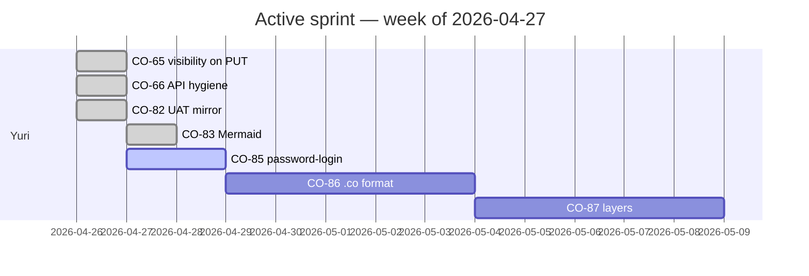

GIVEN `co-dev` already exists as a hidden universe (CO-43) showing CO-* tasks in the dev board, but it doesn't include the actual *development history* — every commit, who made it, when, against which branch, what tests passed; AND the platform's temporal model (CO-73), relationship graph (CO-74), and Mermaid renderer (CO-83) are arriving with no canonical use case to validate them on,
WHEN we expand `co-dev` to ingest the git history of `artelonga/co` as content (one entry per commit, typed as `commit`, with author, timestamps in the author's IANA timezone, parent task linkage, and a Mermaid Gantt of the active sprint), and add user-profile + analytics primitives,
THEN `co-dev` becomes the canonical proving ground for CO-63 manifest, CO-73 temporal, CO-74 relations, CO-83 diagrams, and CO-46 telemetry — every architectural concern lit up by real, growing data.

## What `co-dev` becomes

Today: a private universe with task entries (CO-1..CO-89.md) and a board view.

After CO-89:
- **Same task entries** (no migration of CO-*.md content)
- **+ commit entries** — one per git commit on `main`, with frontmatter:
  - `entry_type: commit`, `sha`, `author_handle`, `committer_handle`
  - `created_at_ns`, `timezone_iana` (from `git log --format=%aI`)
  - `parent_task: CO-NN` (parsed from commit message — `feat(co-web): CO-65 …` → `CO-65`)
  - `files_changed`, `insertions`, `deletions`, `branch`, `tags`
- **+ event entries** — invitations, planning sessions, releases, deploy events
- **+ user profiles** — one per contributor: handle, display name, timezone, avatar, role, preferences, stats
- **+ analytics dashboards** rendered from the data: velocity, commit frequency, deploy cadence, most-touched files, active branches

## Schema additions (informs CO-70 manifest)

```yaml
# co-dev manifest excerpt (CO-70 format)
content_types:
  - name: task
    schema:
      title: { type: string, required: true }
      status: { type: enum, values: [todo, doing, done, deprecated] }
      due_at: { type: date, semantic: due }
      assignee: { type: ref, target: profile }
      labels: { type: list, of: string }

  - name: commit
    schema:
      sha: { type: string, required: true }
      message: { type: string, required: true }
      author: { type: ref, target: profile }
      committer: { type: ref, target: profile }
      committed_at: { type: date, semantic: event }
      timezone: { type: string }              # IANA, e.g. America/Sao_Paulo
      parent_task: { type: ref, target: task, optional: true }
      branch: { type: string }
      tags: { type: list, of: string }
      files_changed: { type: int }
      insertions: { type: int }
      deletions: { type: int }
    indexes: [sha, author, committed_at, parent_task]

  - name: profile
    schema:
      handle: { type: string, required: true }
      display_name: { type: string }
      timezone: { type: string }              # IANA
      avatar_url: { type: string }
      role: { type: enum, values: [owner, admin, contributor, observer] }
      bio: { type: string }
      analytics: { type: struct }             # see § Per-profile stats
    indexes: [handle, role]

  - name: event
    schema:
      title: { type: string, required: true }
      kind: { type: enum, values: [release, deploy, planning, retro, demo, outage] }
      starts_at: { type: date, semantic: event }
      ends_at: { type: date, semantic: event }
      timezone: { type: string }
      attendees: { type: list, of: ref, target: profile }
      related_tasks: { type: list, of: ref, target: task }
      summary: { type: string }
    indexes: [kind, starts_at]

views:
  - name: board
    type: kanban
    source: task
    columns: [todo, doing, done]

  - name: history
    type: timeline
    source: commit
    date_field: committed_at
    grouping: day

  - name: roadmap
    type: gantt
    source: task
    date_start: created_at
    date_end: due_at
    swimlane_by: assignee

  - name: contributors
    type: cards
    source: profile

  - name: events
    type: calendar
    source: event
    date_field: starts_at
```

## Git → entry pipeline

A background job (CO-78 worker, or a cron for v1) walks `git log` since the last sync and produces one `commit` entry per new commit:

```bash
git log --pretty=format:'%H%x09%aI%x09%aE%x09%cE%x09%P%x09%s' \
        --shortstat origin/main \
        --since=<last_sync> > /tmp/commits.tsv
# Each line: sha\taiso\tauthor\tcommitter\tparents\tsubject
# Followed by " N files changed, X insertions(+), Y deletions(-)"
```

Pipeline:
1. Parse each line into `{sha, committed_at, author_email, committer_email, parents, subject, files_changed, insertions, deletions}`
2. Resolve `author_email` → `profile` ref (creates a profile entry if new)
3. Extract `parent_task` from subject via regex (`(CO-\d+)`)
4. Extract `tags` from any `(scope)` in conventional-commit prefix (`feat(co-web)` → `tags: [co-web]`)
5. Write entry to `co-dev/commits/<sha>.md` (one file per commit, frontmatter + body=`message`)
6. Update `co-dev/profiles/<handle>.md` analytics (commit count, lines touched, last seen)
7. Telemetry: `pipeline.git_sync` event with commits processed, duration

For initial backfill, walk full history: ~150 commits on main today; takes < 5s. Going forward, incremental sync runs hourly (or on webhook from GitHub if/when that lands).

## Per-profile analytics (the `analytics` Struct)

```json
{
  "commits_total": 142,
  "commits_last_30d": 87,
  "lines_added_total": 18234,
  "lines_removed_total": 5012,
  "first_commit_at": "2026-03-27T...",
  "last_commit_at": "2026-04-27T...",
  "active_branches": ["main", "feat/CO-66-…"],
  "frequent_scopes": [["co-web", 78], ["co-auto", 23], ["roadmap", 14]],
  "mean_commit_size_lines": 92,
  "most_touched_files": [["co-web/src/server.rs", 42], ["work/co/CO-77.md", 18]]
}
```

Computed nightly (or on-demand via `POST /api/v1/universes/co-dev/recompute-analytics`). Driven by SQL aggregations over the `commit` entries — no separate analytics store.

## Mermaid views (validates CO-83)

The `gantt` and `timeline` views compile to Mermaid:



Generated server-side from `task` entries with `due_at`/`created_at`. Renders client-side via CO-83.

## Timezone handling

- Every temporal field is stored UTC (epoch ns, per CO-86 frontmatter)
- `timezone_iana` field captures the *meaningful* zone (commit author's, event organizer's)
- Render layer applies the user's profile timezone (or the entry's `timezone_iana`) as a display preference
- Date math (e.g., "events this week") respects the requesting user's timezone for "today" boundaries

This matters for distributed contributors. A commit at `2026-04-26T23:00:00Z` is "April 26 evening" for São Paulo (UTC-3) but "April 27 morning" in Tokyo. The data is the same; the display differs.

## Tasks

### Schema + ingestion (CO-89a)

- [ ] Define content types `task`, `commit`, `profile`, `event` in `co-dev/_universe.yaml` (forward-compat; CO-70 manifest format may not exist yet)
- [ ] `co-web/src/co_dev/git_sync.rs`: walks git log, writes commit entries
- [ ] `co-web/src/co_dev/profiles.rs`: maintains profile entries from author emails
- [ ] Backfill on first deploy: walk full history, populate commits + profiles
- [ ] Incremental hourly job (or GitHub webhook trigger when feasible) — uses CO-78 queue when available, plain cron until then

### UI (CO-89b)

- [ ] `co-dev` board adds three new views: `history` (timeline), `contributors` (cards), `events` (calendar)
- [ ] Profile detail page: avatar + bio + analytics charts (commits/day, lines/day, scopes pie chart)
- [ ] Each commit entry renders as: header (sha, author, time-in-author-tz), body (commit message), metadata (files changed, related task)
- [ ] Wikilinks `[[CO-65]]` in commit messages auto-link to the task entry (uses CO-74 typed wikilink promotion when ready, plain text resolver otherwise)

### Analytics (CO-89c)

- [ ] `recompute_profile_analytics(handle)` → updates the `analytics` struct on a profile entry
- [ ] Nightly job runs across all profiles
- [ ] Admin dashboard (`/co/co-dev/analytics`): top-level stats — total commits, deploys, releases this month; active contributors; release cadence chart

### Telemetry integration (CO-89d)

- [ ] `pipeline.git_sync` events feed the admin pipeline dashboard (CO-88)
- [ ] `event` entries with `kind=deploy` are auto-created when `flyctl deploy` runs (post-deploy hook)
- [ ] `event` entries with `kind=release` are auto-created on git tag push

## Dependencies

- **Light**: works without CO-63 manifest (uses inline schema), without CO-77 sharding (lives in monolithic co.db), without CO-74 typed relations (resolves wikilinks via plain text)
- **Validated by**: CO-73 temporal model (events with timezones), CO-74 relations (commit → task), CO-83 Mermaid (gantt/timeline rendering), CO-46 telemetry (analytics surface)

## Acceptance

- `co-dev` shows 3 views beyond the existing board: timeline of commits, contributors page, events calendar
- Every commit on `main` since 2026-03-27 has a corresponding entry in `co-dev/commits/<sha>.md`
- Profile entries exist for at least Yuri (`yuri@artelonga.com.br`) + the system co-author identity
- Profile analytics renders with real numbers (commits/day, top scopes, etc.)
- A Mermaid gantt for the current sprint renders in the board view
- Wikilinks to `[[CO-65]]` from commit messages link to the task entry
- Timezone display: a commit shows the author's local time (with UTC offset) AND the viewer's local time when they differ
- New commits appear in `co-dev` within 1 hour (incremental sync) or immediately via webhook (when CO-78 + GitHub webhook land)

## Tradeoffs

- **Permission model** — `co-dev` is admin-only today (yuri). Opening it to read-only public consumption later requires considering whether commit messages or analytics leak sensitive context (probably not, but worth a re-check before flipping visibility).
- **Storage growth** — at typical project velocity (~5-10 commits/day), `co-dev` grows ~150 entries/month. After CO-77 (per-universe SQLite), the universe DB stays small.
- **Re-sync after rebase** — if `main` ever rebases, the SHA changes; sync skips already-imported SHAs but won't delete orphaned entries. A reconciler (compare git log to entry index, mark missing entries as `status: orphaned`) is a v2 concern.

## Out of scope (deferred)

- Cross-repo aggregation (commits from quilomboaraucaria as separate co-dev?) — defer until that repo also adopts the manifest model
- PR / issue ingestion (only commits for v1; PRs are conversational data and need their own modeling)
- Code-coverage trending — depends on CI artifacts that don't exist yet
- AI-generated commit summaries — defer indefinitely
