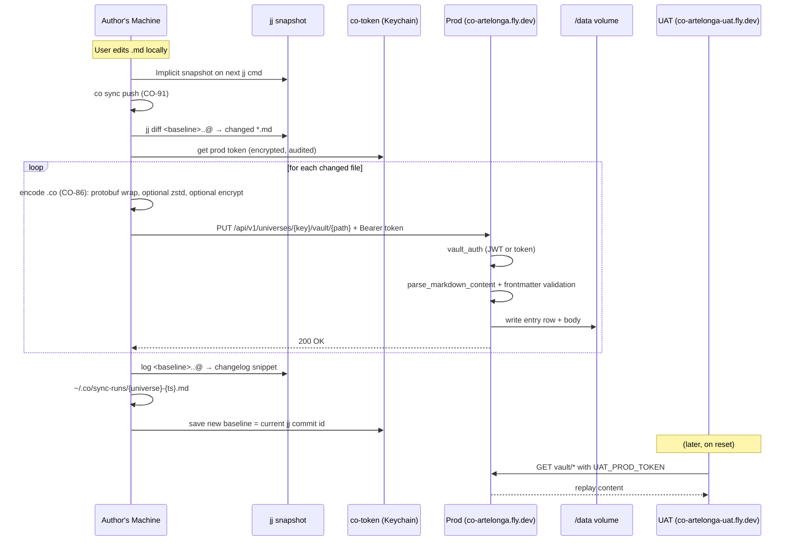
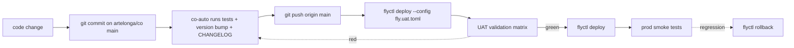
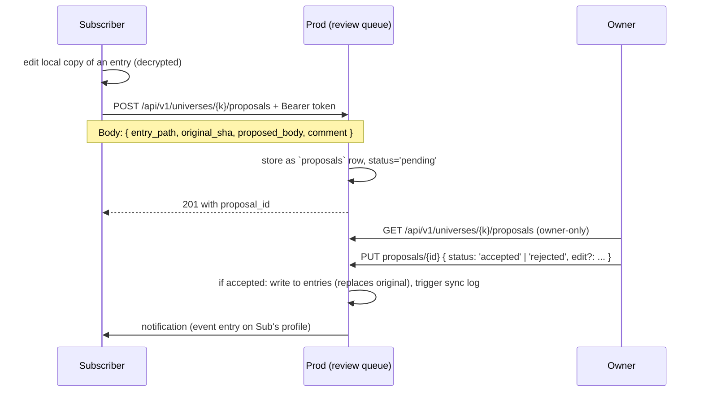

GIVEN the platform conflates several orthogonal concerns under a single `visibility` enum (`private` / `public-subscribable` / `requires_login` / `template`), and the actual architecture has four distinct axes — **read visibility**, **edit model** (who can write directly), **proposal model** (who can submit pending edits), and **encryption-at-rest** — and the user-facing taxonomy is cleaner as **three universe types**: public static, private static, private dynamic,
WHEN we make these three types first-class (with `visibility` either deprecated to `BillingTier`-style billing-only or refactored into a richer composite), the encryption layer (CO-86 / CO-87) becomes the default for private content, and the proposal flow (CO-60 generalized) is the only path for subscriber edits to private dynamic universes,
THEN the platform has one canonical access model that supports the goal of **open-sourcing the codebase while keeping content private at rest**, plus a clean per-universe answer to "is this static or dynamic, public or private."

## The three universe types

| Type | Read | Edit directly | Submit proposal | Encrypt at rest | Static-export-able |
|------|------|---------------|-----------------|-----------------|--------------------|
| **public static** | anyone (no auth) | owner + members | (no proposal flow) | no | yes — pre-render to CDN |
| **private static** | members only (auth required) | owner + members | (no proposal flow) | yes (per-recipient envelope) | no |
| **private dynamic** | members + subscribers | owner + members | subscribers (via review queue) | yes (decryption keys per subscriber) | no |

Conceptual axes:

- **Read visibility**: public (no auth) vs private (auth + membership/subscription required)
- **Edit model**: members write directly; outsiders cannot
- **Proposal model**: only relevant for `private dynamic`; subscribers submit pending edits, owner reviews
- **Encryption**: only relevant for private types; ciphertext-only on server

The existing `template` visibility is a special administrative case (system-owned, read-anyone, write-system-only) — it's a flavor of public static but with no human owner.

## Mapping today → after CO-93

| Today (visibility) | After CO-93 (universe_type) |
|--------------------|------------------------------|
| `private` | `private-static` |
| `public-subscribable` (no proposals) | `public-static` |
| `public-subscribable` (with proposals enabled) | `private-dynamic` (read by subscribers + members; subscribers propose) |
| `requires_login` | absorbed into `private-static` (any logged-in user is a member of public-login universes) |
| `template` | special: marker for system-owned public-static |

`requires_login` was a partial answer to "I want to limit reads to logged-in users without scoping to membership." Under CO-93 that's just a public-static universe with `requires_login: true` as a flag.

## Sync flow (after-edit propagation)



After CO-86 ships, the encoded `.co` carries the encryption envelope. The server stores ciphertext only for private universes. Sync flow stays identical at the API level; the difference is the bytes on the wire.

## Deployment routine



**Universe content is decoupled from deploys.** Content lives on `/data` (Fly volume); deploys swap the binary but don't touch user data. Migrations run on startup; existing data preserved or upgraded in place.

## Open source + encrypted at rest

Goal: anyone can clone `artelonga/co`, deploy their own instance, and run the same platform — but without access to other users' encrypted content.

What stays open:
- Source code (Rust, JS)
- Schema (`*.proto`, SQL migrations)
- Auth mechanisms (Argon2id, JWT, API tokens)
- Deployment configs (`fly.toml`)

What stays private:
- User content of private universes (encrypted body in `entries.payload`)
- Per-user encryption keys (live on user devices via `co-token` / OS keychain)
- Subscriber recipient sets (encrypted key wrappings)
- Auth tokens (Argon2id-hashed; OS-keychain on the client)

What the server CAN see for private content:
- Frontmatter (currently plaintext; could be encrypted in v2 — design choice trading search/index against confidentiality)
- File paths (currently plaintext; same trade-off)
- File sizes, timestamps (necessary for sync)
- Metadata: which user wrote what, when

What the server CANNOT see:
- Body content for `private-static` and `private-dynamic` universes
- Subscriber-specific key envelopes (only the recipient can unwrap)

This is the model used by Standard Notes, Tutanota, ProtonMail. CO-86 and CO-87 specs already lay out the protocol-buffer envelope and the layer composition.

## Proposal flow (private dynamic)



CO-60 ("invite + review system — role-based access, invite flow, task review workflow") already specs the role-based access. CO-93 extends it to per-entry proposals from non-member subscribers.

## Static export (public static)

For public static universes, server-rendered HTML can be cached at CDN edge with long TTL and refreshed via webhook on entry write. This collapses the read path to:

```
[edge CDN] → 200 OK with cached HTML (TTL 60s with stale-while-revalidate 24h)
[edge cache miss] → server-rendered HTML (markdown → marked + DOMPurify + theme.css inline)
```

Effort:
- Add a server endpoint `GET /co/{slug}/{path}.html` that returns rendered HTML
- Set `Cache-Control: public, s-maxage=60, stale-while-revalidate=86400` for public-static universes
- On entry write, emit a CDN purge for that path

For Cloudflare-style edge: `Cache-Tag` headers + a one-shot purge API call from `vault_routes::put_vault_file`.

## Implementation phases

### Phase 1 — refactor visibility into universe_type (1.20.0 era)

- [ ] Migrate `universes.visibility` to `universes.universe_type` enum: `public-static` | `private-static` | `private-dynamic` | `template`
- [ ] Migration: `private` → `private-static`; `public-subscribable` → `public-static` (default; opt-in to dynamic via separate `accepts_proposals` flag)
- [ ] Update CO-49 access checks to use the new field
- [ ] Deprecate `requires_login` (subsumed by membership)

### Phase 2 — encryption-at-rest (3.0 era, lands with CO-86 + CO-87)

- [ ] User keypair (Ed25519 / Curve25519) generated locally on first login
- [ ] `co-token` extended to store keypair (or new `co-key` binary)
- [ ] CO-86 `Encrypted { algo, ciphertext, nonce, encrypted_key, key_recipient }` populated for private universes
- [ ] CO-87 `Privacy::ChaCha20Encrypted` layer is default for `private-static` + `private-dynamic`
- [ ] Recipient set: owner + members for private-static; owner + members + subscribers for private-dynamic

### Phase 3 — proposal flow (3.1 era)

- [ ] `proposals` table: `(id, universe_key, entry_path, original_sha, proposed_body, status, author_user_id, comment, created_at, reviewed_at, reviewer_id)`
- [ ] `POST /api/v1/universes/{k}/proposals` — subscriber-only
- [ ] `GET /api/v1/universes/{k}/proposals` — owner-only
- [ ] `PUT /api/v1/universes/{k}/proposals/{id}` — accept/reject
- [ ] On accept: write to entries; emit `event` entry of kind `proposal-accepted`
- [ ] UI: per-universe "Proposals" tab in board view

### Phase 4 — static export (3.2 era)

- [ ] Server-rendered HTML endpoint for public-static universes
- [ ] `Cache-Control` headers tuned for CDN
- [ ] On vault write: emit CDN purge for affected paths
- [ ] Optional: build-time static export to a separate domain (e.g., `artelonga.com.br/sobre` → public-static universe content)

## Composition with the rest of the roadmap

| Task | Role |
|------|------|
| CO-49 (deterministic access) | foundation; CO-93 reshapes it from `visibility` enum to three types |
| CO-60 (invite + review) | becomes the per-entry proposal flow for `private-dynamic` |
| CO-86 (.co format) | the encryption envelope is in this format |
| CO-87 (composable layers) | `Privacy` layer is on by default for private types |
| CO-90 (drop global admin) | CO-93 reinforces the principle: every user is admin only of their universes |
| CO-91 (co sync) | sync flow updates with `.co` encoding when CO-86 ships |
| CO-89 (git-backed universes) | per-universe `commit` entries; private universes' commits stored encrypted |

## Tradeoffs

- **Encrypting frontmatter** — debate. Plaintext frontmatter enables server-side indexing, search, sort, group-by. Ciphertext frontmatter means client-side filtering only. **Recommend**: plaintext frontmatter for v1 (search works); encrypted bodies. Revisit when search-over-encrypted matters.
- **CDN caching of public static** — adds an edge dependency. **Recommend**: Cloudflare Workers in front of Fly. Single config; no architectural changes.
- **Subscription proposals introduce moderation cost** — every accepted proposal needs an owner review. **Recommend**: enable proposals only when the owner explicitly opts in; default off for `private-dynamic`.

## Acceptance

- Visibility enum migrated; existing universes mapped correctly
- Private content encrypted at rest (server-side query of `entries.payload` returns ciphertext for private universes)
- Subscriber proposes an edit; owner sees it in queue; accepts; entry updates
- Public static universe served via CDN with verified cache hits
- Open-sourcing the repo: a third party can clone, run, but cannot read existing user content (because the encryption keys are on user devices)
- All existing tests pass; new tests cover each universe-type transition

## Out of scope (deferred)

- End-to-end encrypted SEARCH (HE/FHE / encrypted indexes) — defer indefinitely; plaintext frontmatter handles 90% of search needs
- Per-entry granular access (some entries in a universe public, others private) — defer; universe-level granularity is enough for v1
- Anonymous proposals (no account required) — security concern; require subscriber identity for v1
- Cross-universe content sharing (the same entry in multiple universes) — interesting; defer
