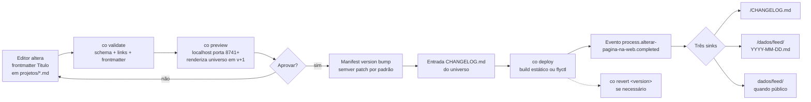

# Alterar página na web

Processo determinístico para mudar o título (ou qualquer campo de frontmatter) de uma página em um universo, com revisão local antes do deploy. Cada execução é uma **mudança atômica**: um bump semver, uma entrada no CHANGELOG, um evento na trilha do `dados/`.

## Cadeia source → sink



## Etapas

### 1. Trigger — edição da fonte

O usuário edita um campo de frontmatter (tipicamente `Titulo`) em um arquivo `.md` sob `projetos/` no universo alvo:

```markdown
---
Titulo: "Hello World"   ← campo editado
slug: index
type: page
---

# Página inicial
...
```

A edição pode vir de:

- O editor do SPA (modal de página, salva via `PUT /api/v1/universes/<u>/vault/<path>`)
- O plugin Obsidian (vault sync)
- O CLI (`co edit <universe>/<path>`)
- Edição direta no filesystem se o universo é universe-as-repo (CO-50)

### 2. Source — campo `Titulo` do entry

A "fonte" é o frontmatter do entry. Um diff é computado entre v atual e v+1.

### 3. Review — `co preview`

```bash
co preview <universe>            # padrão: porta 8741, abre o navegador
co preview <universe> --port 8888
co preview <universe> --diff      # mostra apenas o diff, sem servidor
```

`co preview` faz:

1. Snapshot do universo no estado atual (v)
2. Aplica a edição em memória → estado proposto (v+1)
3. Inicia um servidor HTTP local que serve o universo no estado v+1
4. Renderiza um painel lateral com o diff frontmatter
5. Não toca em produção

O usuário inspeciona localhost:8741, valida visualmente.

### 4. Approval — gate manual ou automatizado

```bash
co preview <universe> --approve   # aprova o que está em preview
# ou clique no botão "Aprovar" na UI do preview
```

Validações automáticas executam antes da aprovação:

- `co validate <universe>` — schema, frontmatter obrigatório, links internos válidos
- Verificação de imagens quebradas (se manifest.yaml declarar `validate.images: true`)
- Linter de markdown (se manifest declarar)

Se qualquer validação falhar, o passo retorna a [1] com um erro acionável.

### 5. Sink — bump + CHANGELOG + deploy

Três escritas atômicas (idealmente em uma transação):

```bash
co deploy <universe>
```

Equivale a:

1. **Manifest version bump**:

   ```yaml
   # antes
   version: 1.5.2
   # depois
   version: 1.5.3
   ```

   Bump semver: padrão `patch` para mudança de frontmatter; `minor` para nova entrada; `major` se manifest declarar `breaking_changes_required: true`.

2. **CHANGELOG.md no universo**:

   ```markdown
   ## [1.5.3] — 2026-05-02

   ### Changed
   - `projetos/index.md` — título "Hello" → "Hello World" (alterado por @yuri)
   ```

3. **Build/Deploy**:

   - Universos `static-on-r2`: rebuild estático + upload R2 (CO-134)
   - Universos `cloudflare-pages`: trigger CF Pages build (CO-135)
   - Universos `fly`: `flyctl deploy` (legacy / control-plane)
   - Universos `git-backed` (CO-50): `git commit` + `git push` à branch tracked

### 6. Telemetry — três sinks

O evento canônico:

```json
{
  "type": "process.alterar-pagina-na-web.completed",
  "timestamp": "2026-05-02T...Z",
  "universe": "<key>",
  "page": "projetos/index.md",
  "field": "Titulo",
  "from_value": "Hello",
  "to_value": "Hello World",
  "from_version": "1.5.2",
  "to_version": "1.5.3",
  "actor_id": "<user_id>",
  "deploy_target": "static-on-r2 | cloudflare-pages | fly | git-backed",
  "deploy_status": "success | failed",
  "deploy_duration_ms": 4321
}
```

Materializa-se em três entries:

| Sink | Caminho | Quem lê |
|------|---------|---------|
| Universe-local | `<universe>/CHANGELOG.md` (apend) | Qualquer leitor do universo |
| Per-user | `<username>/dados/feed/YYYY-MM-DD.md` (append) | Apenas o usuário |
| Global | `dados/feed/YYYY-MM-DD.md` (apend, se universo público) | Admins via `dados` system universe |

### 7. Rollback — `co revert`

```bash
co revert <universe> <version>   # rollback para uma versão semver específica
co revert <universe>             # rollback para a versão imediatamente anterior
```

`co revert` segue a **mesma cadeia, direção inversa**:

1. Reverter manifest (`v+1 → v`)
2. Inverter o último entry do CHANGELOG (anota como `### Reverted`)
3. Re-deploy
4. Emite evento `process.alterar-pagina-na-web.reverted` com referência ao run anterior

## Source → Sink data sync

| Estado | Onde vive | Atualizado por |
|--------|-----------|----------------|
| Markdown source | `<universe>/projetos/*.md` (filesystem + per-universe `data.db` entries) | Editor / Obsidian / CLI |
| Manifest | `<universe>/_universe.yaml` | Bump na sink step (5.1) |
| CHANGELOG | `<universe>/CHANGELOG.md` | Append na sink step (5.2) |
| Build artifact | Per-target: R2, CF Pages, Fly volume | Sink step (5.3) |
| Live URL | Public DNS via target | Sink step (5.3) |
| User feed | `<username>/dados/feed/YYYY-MM-DD.md` | Telemetry materializer |
| System dashboard | `dados/feed/YYYY-MM-DD.md` | Telemetry materializer |
| Run history | `<username>/dados/processos/alterar-pagina-na-web/runs/<id>.md` | Sink step (5.4) |

A consistência entre estados é garantida por:

- **Atomicidade dentro do sink** — bump + CHANGELOG + deploy em uma transação lógica; falhas em qualquer ponto disparam compensação (revert)
- **Idempotência** — re-rodar `co deploy` na mesma versão é no-op
- **Trilha de auditoria** — cada run tem um ID único, registrado em `dados/processos/<process>/runs/`

## Acceptance criteria do processo

Um run desta `processos/alterar-pagina-na-web` é **válido** quando:

- [ ] O campo editado foi `Titulo` (ou outro declarado em `process.allowed_fields`)
- [ ] `co validate` passou no preview
- [ ] Preview rodou em localhost por pelo menos 1 segundo (gate visual mínimo)
- [ ] Aprovação foi explícita (manual ou via flag --approve)
- [ ] Manifest version bump foi semver-correto
- [ ] CHANGELOG entry foi gerada
- [ ] Deploy chegou ao target
- [ ] Evento de telemetria foi escrito nos três sinks aplicáveis

Um run **falho** ainda é registrado, com `deploy_status: "failed"` e o erro estruturado.

## Casos limite

- **Universo público de só-leitura (template)**: o processo é desabilitado; `co deploy template` retorna 403. A edição via SPA já é gated pelo `check_universe_access`.
- **Edição concorrente**: se outro usuário editou entre `co preview` e `co deploy`, o sistema detecta via `body_hash` e exige re-validação (CO-128 conflict UI).
- **Universe-as-repo** (CO-50): o sink step adiciona `git commit` + `git push` antes do deploy; o run-id é o commit hash.
- **Encrypted universe** (Phase 4 / CO-86): o evento de telemetria é cifrado sob a chave do universo antes de ir para os sinks `dados/`; admins veem apenas metadados sem o conteúdo do field.

## Referências

- [CO-144](../CO-144.md) — Per-user dashboard + cross-universe activity feed (este processo é a primeira instância concreta do Phase C)
- [CO-50](../CO-50.md) — Universe-as-repo (alimenta o sink step 5.3 para universos git-backed)
- [CO-91](../CO-91.md) — `co sync` (subjacente ao deploy step para universos sincronizáveis)
- [CO-128](../CO-128.md) — Apple-style 4-way conflict UI (acionada se houver edição concorrente entre preview e deploy)
- [CO-86](../CO-86.md) — `.co` envelope format (cifragem dos eventos de telemetria; Phase 4)

## Estado de implementação (2026-05-02)

| Etapa | Implementação |
|-------|---------------|
| Trigger (1) | ✅ SPA modal + Obsidian + CLI já permitem edição de frontmatter |
| Source (2) | ✅ Frontmatter parsing existente |
| Review (3) | ❌ `co preview` ainda não implementado — CO-145 |
| Approval (4) | ❌ Gate UI não existe — CO-145 |
| Sink — bump (5.1) | 🟡 Manual via Cargo.toml; precisa generalizar para universos não-código |
| Sink — CHANGELOG (5.2) | 🟡 Manual; precisa append automatizado por universo |
| Sink — deploy (5.3) | 🟡 Por-target; varia por target adapter (CO-134/135/etc.) |
| Telemetry (6) | ❌ Materializer não existe — CO-144 Phase B |
| Rollback (7) | ❌ `co revert` não implementado — separar em CO-146 |

Este processo é uma **especificação ativa**: o markdown documenta o pipeline desejado; cada etapa marcada ❌ tem um ticket associado para implementação. À medida que tickets são fechados, esta entrada vai sendo atualizada — a própria atualização passa pela cadeia que descreve.
